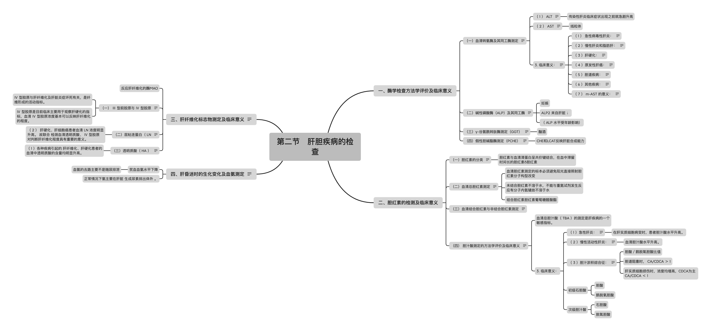

# 第十章　肝胆疾病的实验室检查
本章考点：
1.肝胆生化
（1）肝脏的代谢
（2）肝脏的生物转化功能
（3）胆汁酸代谢紊乱与疾病
（4）胆红素代谢与黄疸
2.肝胆疾病的检查
（1）酶学检查方法学评价、参考值及临床意义
（2）胆红素代谢产物和胆汁酸测定的方法学评价及临床意义
（3）肝纤维化标志物的测定及其临床意义
（4）肝昏迷时的生化变化及血氨测定
3.肝细胞损伤时的其他有关检查及临床意义
（1）蛋白质代谢异常的检查
（2）糖代谢异常的检查
（3）脂代谢异常的检查
（4）各种急、慢性肝病时综合考虑应选择的试验及其临床意义
肝是人体重要的代谢器官，对维持机体内外其环境的稳定起着十分重要的作用.
其主要功能有：
1.代谢功能，参与糖、脂类、蛋白质、维生素的合成、分解和储存；核酸代谢；激素的生物转化；胆红素和胆酸的代谢。
2.排泄功能，如胆红素、胆酸、药物、某些阴离子染料等的运输和排泄。
3.解毒功能，参与对药物、毒物等化合物的氧化、还原、水解、结合等。
4.凝血和纤溶因子、纤溶抑制因子的生成及对活性凝血因子的清除等。
在正常情况下，肝脏各种功能有条不紊地进行，当肝脏受到各种致病因素侵袭时，其功能状态和组织结构必然受到影响。
肝的病理状态大致可分为肝细胞损伤，间质反应，胆汁淤积，局限性肝损害及肝血管系统损害五种。以上病理改变往往合并存在，但有所侧重，从而出现各种肝病的实验室检查特征，导致有关的试验结果异常。

# 第一节　肝胆生化

## 一、肝脏的代谢功能

### 1.糖代谢:
肝脏是维持血糖浓度相对稳定的重要器官。

肝脏通过肝糖原的合成分解及糖异生作用维持血糖浓度的恒定。
### 2.蛋白质代谢：

（1）合成与分泌90%以上的血浆蛋白质，其中合成量最多的是白蛋白。

（2）肝脏合成的许多凝血因子和纤维蛋白原等，在血液凝固功能上起重要作用。

（3）转化和分解氨基酸

（4）合成尿素。
### 3.脂类代谢：
肝脏在脂类的消化、吸收、分解、合成及运输等代谢过程中均起重要作用。

（1） 肝分解甘油三酯和脂肪酸的能力很强，参与脂肪酸的β氧化，并且进行酮体合成

（2）肝细胞是合成胆固醇、甘油三酯和磷脂的最重要的器官.

（3）合成某些脂蛋白和载脂蛋白及脂蛋白代谢的酶类，参与脂蛋白的代谢和脂类的运输。
### 4.维生素及激素代谢
#### 1.维生素

（1）肝脏能储存多种维生素，如维生素A、B、D、E、K及B12等。

（2）肝脏是维生素转化的场所
胡萝卜素转变成维生素A，维生素D3在25位上羟化，维生素PP合成NAD+和NADP+，维生素B1合成TPP等过程均在肝内进行。
#### 2.激素
激素的灭活主要在肝脏进行。
血浆中的类固醇激素进入肝脏，被肝细胞摄取后，进行一系列转化反应，改变了活性，最后生成易于排泄的代谢终末产物。
许多蛋白质及多肽激素的灭活和氨基酸衍生的激素（肾上腺素及甲状腺素等）分解代谢主要是在肝脏。

## 二、肝脏的生物转化功能
### （一）概念：
机体对非营养物质进行代谢的过程
生物转化主要在肝脏进行。
肺、肠、肾等组织也具有一定的生物转化能力。
### （二）意义：
肝脏的生物转化过程，常在肝细胞的微粒体、线粒体及胞质等处有关酶的催化下，使非极性化合物转化为极性基团，使脂溶性极强的物质增加水溶性，有利于代谢产物、药物、毒物等从肾脏和胆道排出。
### （三）反应：两相反应。
第一相反应：氧化、还原、水解反应。
这些反应直接改变物质的基团或使之分解

第二相反应：结合反应
有些物质经过第一相反应即可充分代谢或迅速排出体外，但还有许多物质经过第一相反应后，极性的改变仍不大，必须与某些极性更强的物质（如葡萄糖醛酸、硫酸、氨基酸等）结合，增加溶解度，或者甲基化、乙酰化等改变了反应，才能最终排出体外。
这种肝内的结合反应称为第二相反应。

## 三、胆汁酸代谢
胆汁酸是胆汁的主要成份，在肝细胞内由胆固醇转化生成。成年人每日合成400～600mg，均存在胆汁中。

### （一）分类：

### （二）胆汁酸的功能
胆汁酸在脂肪的吸收、转运、分泌和调节胆固醇代谢方面起重要作用。

胆汁酸是脂类消化吸收的乳化剂，也是脂肪酶的激活剂。
### （三）胆汁酸的肝肠循环
肝细胞分泌的初级胆汁酸大部分以结合形式分泌人胆汁，再排入小肠，约95%的胆汁酸在回肠末端被重吸收经门静脉至肝，经过肝细胞变为结合胆汁酸后，连同新合成的初级胆汁酸一起再分泌至胆汁中，上述这种由肠至肝的过程，称为肠肝循环。

肝肠循环使有限的胆汁酸发挥最大的作用。

### 四、胆红素代谢与黄疸（肝对胆红素的摄取、转化及排泄）
#### （一）胆红素代谢
##### 1.生成：
体内的胆红素主要来自衰老红细胞中血红蛋白分解产生的血红素。
##### 2.血中运输
主要以胆红素白蛋白复合物的形式存在和运输。（不能被肾小球滤过）
##### 3.肝内代谢：
肝脏对胆红素有摄取、转化、排泄的功能。
###### （1）摄取：
胆红素随血运输到肝后，在膜上与白蛋白解离，并被肝细胞摄取。

肝细胞内有Y蛋白和Z蛋白的两种色素受体蛋白。

Y蛋白是肝细胞主要的胆红素转运蛋白，Z蛋白对长链脂肪酸具有很强的亲和力。

Y、Z蛋白与进入胞质的胆红素结合，并将它运至内质网。
###### （2）转化：
肝细胞对胆红素的转化在滑面内质网上进行，在胆红素-尿嘧啶核苷二磷酸葡萄糖醛酸转移酶的催化下，胆红素被转化为单、双葡萄糖醛酸结合胆红素，形成水溶性的结合胆红素（可通过肾脏）。
###### （3）排泄：
结合胆红素随胆汁排泄至肠道。
##### 4.肠内变化：
在回肠末端至结肠部位，在肠道菌的作用下大部分被水解而脱下葡萄糖醛酸，还原成无色的胆素原。

正常人每天从粪便排出40～280mg胆素原，它在肠管下段接触空气后被氧化成为棕黄色胆素，随粪便排出，成为粪便的主要色素。

一部分胆素原可被肠黏膜重吸收进入肝门静脉，其中大部分以原形再排入胆道，小部分（0.4～4mg）经体循环随尿排出。

#### （二）黄疸
正常人血清总胆红素<10mg/L
当各种原因导致血液中游离胆红素或结合胆红素升高时，可导致黄疸。

根据机制分成三类
##### 1.溶血性黄疸来源增多
血中游离胆红素浓度明显升高，尿胆原升高,尿中胆红素阴性.
##### 2.阻塞性黄疸排泄受阻
血中结合胆红素明显升高，尿胆原降低，尿胆红素阳性。
##### 3.肝细胞性黄疸处理障碍
血中两种胆红素都升高，尿胆原正常或升高，尿胆红素阳性。

第二节　肝胆疾病的检查

肝脏疾病的生化改变包括胆红素代谢障碍、胆汁酸代谢障碍、血浆酶异常、血浆蛋白异常。

一、酶学检查方法学评价及临床意义
（一）血清转氨酶及其同工酶测定
氨基转移酶是催化α-氨基酸和α-酮酸之间氨基转移的酶。
用于检测肝细胞损伤程度的主要是丙氨酸氨基转移酶（ALT）和天门冬氨酸氨基转移酶（AST）。
两种酶的检测现采用酶动力学方法，诊断酶学一章已作介绍
1.概况
（1）ALT
ALT广泛存在于多种器官中，按含量多少顺序为肝脏、肾脏、心脏、骨骼肌等。
肝细胞的ALT主要存在于细胞质中，只有少量在线粒体中。
由于肝细胞中ALT活性约比血清高2850倍，故有1%的肝细胞损伤，就足以使血液中ALT活性升高1倍。
（2）AST
AST也广泛存在于多种器官中，按含量多少顺序为心脏、肝脏、骨骼肌和肾脏等。
肝细胞中AST大部分（60%）存在于线粒体中，少部分存在于胞质中。
AST有两种同工酶，存在于胞质中的称为胞质AST（c AST）；
存在于线粒体中的称为线粒体AST（m-AST）。
正常血清中大部分为c-AST，m-AST仅占l0%以下。
2.参考值：
ALT：<40u／L（37℃） （酶速率法）
AST：<45U／L（37℃） （酶速率法）
AST／ALT：1.15左右
3.临床意义：
ALT和AST均属于肝细胞内非特异性功能酶，生理情况下血清转氨酶活性很低.
（1）急性病毒性肝炎：
ALT虽不特异，但是最敏感的指标。
在急性肝炎过程中，血清ALT活性高低多与临床病情轻重相平行。
肝炎患者血清ALT变化规律一般为三种：
①急性病毒性肝炎，早期ALT升高，出现黄疸后ALT急剧升高，高峰可达正常人的10倍以上，至黄疸极期，ALT迅速下降。某些无黄疽患者早期ALT也可急剧升高，达高峰后迅速下降至100～200U／L时，常常持续一段时间后恢复正常；
②部分无黄疸型肝炎患者早期ALT升高不明显，长期留于较高水平，持续数月或数年而转为慢性肝炎；
③轻型无黄疸型肝炎常常只有一过型ALT升高，很快恢复正常。
ALT的半寿期为47±10小时，AST的半寿期为17±5小时，急性肝炎恢复期AST先于ALT恢复正常。
急性肝炎和亚急性重症肝炎早期，ALT明显增高，随病情恶化，大量肝细胞坏死，致血中ALT下降，甚至在正常范围内，与此同时胆红素却进行性升高，呈现“酶胆分离”现象，此为重症肝炎临终期的表现，预后极差。
在急性肝炎时肝细胞轻度损害，线粒体未受破坏，血中ALT升高程度大于AST，AST／ALT比值降低，而且血清中AST大部分为c-AST，如损害严重，线粒体受到破坏，血清m-AST才升高，故m-AST升高是肝细胞坏死的指征。
（2）慢性肝炎和脂肪肝：
慢性迁延型肝炎ALT、AST轻度上升，一般不超过参考值的3倍，有时可降至正常，其他肝功能试验正常。
当病变累及线粒体时AST升高程度可超过ALT。
慢性活动型肝炎，ALT多数升高至参考值3～5倍以上，且长期维持在较高水平。如伴有肝坏死时ALT可升高到参考值10倍以上。
脂肪肝，ALT可持续轻度升高并伴有高脂血症。
（3）肝硬化：
肝硬化代偿期患者血清ALT可轻度增高或正常，失代偿期ALT可持续升高。
胆汁淤积性肝硬化ALT活性较高可与黄疸平行，AST升高不及ALT显著。
肝硬化病变累及线粒体时，多数AST升高程度超过ALT。
（4）原发性肝癌：
ALT可正常或轻中度升高，提示可能并发肝坏死，预后严重。
（5）胆道疾病：
正常时肝细胞内ALT、AST的一部分可通过肝细胞膜到肝窦状隙而进入血液，一部分通过溶酶体分泌进入毛细胆管排入小肠，故当各种原因引起胆道梗阻时，后部分酶反流入血，可致ALT中度升高，梗阻缓解后l～2周即可恢复正常。
（6）其他疾病：
ALT广泛存在于各组织中，机体器官有实质性损害时，ALT均可增高。如急性心肌梗死、右心功能不全、多发性肌炎、肌营养不良、急性肾盂肾炎、大叶性肺炎、支气管炎、传染性单核细胞增多症、溃疡性结肠炎、细菌性或阿米巴性肝脓疡等疾病、疟疾、血吸虫病，外伤、手术等均可造成血清ALT和AST增高。
某些化学药物如异菸肼、氯丙嗪、利福平、环磷酰胺和某些抗生素等也可引起血清ALT增高，所以ALT单项增高，需要结合病情综合分析。
（7）m-AST的意义：
m-AST可协助判断肝实质损害的严重程度。
当急性肝炎病变严重累及线粒体时，AST／ALT比值升高，此时应注意是否发展为慢性肝炎。肝硬化时可达2.0。在Reye综合征、妊娠脂肪肝、心肌梗死、做导管肝动脉栓塞术后，m-AST也可升高。
（二）碱性磷酸酶（ALP）及其同工酶
1.概况：
碱性磷酸酶是一组在pH 9-10.5的碱性环境中催化有机磷酸酯水解的酶。
血清中的ALP主要来源于肝脏、骨骼、少部分来自小肠和妊娠期胎盘组织，肾脏也有极少量，肝细胞产生的ALP一般从胆道排人小肠。
等位基因型（ALP）分为非组织特异形、胎盘型和肠型。
非组织特异形ALP分布于肝脏、骨骼、肾脏等组织器官。
琼脂糖凝胶电泳可将ALP分为6种同工酶，从阳极向阴极按泳动速度快慢依次分为ALP1～ALP6，ALP1是细胞膜组分和ALP2的复合物；ALP2来自肝脏；ALP3来自骨骼；ALP4来自妊娠期胎盘；ALP5来自小肠；ALP6是IgG和ALP2的复合物。
检测原理前已述及。
2.参考值：
成人40～150U／L（37℃）
3. 临床意义：
（1）生理性增高：
妊娠3个月时胎盘即可产生ALP，9个月达高峰，可为同龄妇女的3～4倍，分娩后一个月左右即恢复正常；
绝经期后妇女ALP水平有所上升；
新生儿、儿童、青少年骨骼生长期比成人要高，1～5岁有一个高峰，是成人的2～4倍；10～18岁再有一个高峰，是成人的4～5倍。（ALP水平受年龄影响）
（2）肝胆管梗阻的疾患：
血清ALP水平可增高。
肝中ALP经胆汁排入小肠。
梗阻性黄疸时，由于肝内、外梗阻使胆汁排出不畅，再加上胆汁具有表面活性剂作用可洗脱ALP反流入血，使血中浓度增高。
毛细胆管内压亢进时，可诱发ALP生成增加，患者血中ALP浓度呈明显持续性升高，可达正常上限的10倍之多。
（3）肝炎或肝硬化时，ALP可轻度增高，很少超过正常上限3倍。
（4）原发或继发肝癌时，ALP明显升高。
肿瘤组织压迫附近胆小管使之阻塞，肿瘤组织或炎症可刺激周围肝细胞过多产生ALP。
ALP持续轻度升高应考虑肝有无占位性病变。
（5）骨骼系统病变时，血清ALP可有程度不同的升高。
成骨细胞增生活跃的状况下，如成骨细胞瘤、骨折恢复期、变形性骨炎、佝偻病、转移性骨肿瘤（前列腺癌、膀胱癌、乳腺癌、原发性肝癌）等；
（6）其他疾病：
甲状旁腺功能亢进、高维生素D血症、肢端肥大症等，血中ALP均升高。
碱性磷酸酶同工酶的检测对肝外阻塞性黄疸及肝内胆汁淤积性黄疸，原发与继发性肝癌具有鉴别意义。
ALP1升高可见于肝外胆管梗阻，ALP2升高见于转移性肝癌、肝脓肿、肝淤血等。而肝内胆管梗阻所致胆汁淤积，如原发性肝癌及急性黄疸性肝炎患者则以ALP2的增高为主，ALP1相对减少。
（三）γ-谷氨酰转肽酶测定（GGT）
1.概况：
γ-谷氨酰转肽酶（GGT）是在氨基酸吸收中，参与r-谷氨酰基循环的一个重要的酶。
该酶在体内分布较广，按其活性强度的顺序排列依次为：肾脏、前列腺、胰腺、肝脏、脾脏、肠、脑等。
不同器官的GGT的理化性质有差异，血清中的GGT主要来自肝脏，少量来自肾脏、胰腺。
GGT在肝内由肝细胞线粒体产生，90%为膜结合型，分布在肝细胞膜及毛细胆管的上皮，在胆汁淤积时、肝内合成亢进（如慢性肝炎、肝硬化）、肝癌产生特异性的GGT同工酶等情况下可升高。
目前国内主要采用IFCC和欧洲常规Szasz法。二者均是以γ谷氨酰-3-羧基-4-对硝基苯胺和双甘肽为底物的酶动力。GGT作用于γ-谷氨酰-3-羧基-4-对硝基苯胺和双甘肽产生γ一谷氨酰双甘肽和5-氨基2-硝酸苯甲酸盐，在405nm处检测吸收峰，计算出血清中GGT的浓度。
2.参考值：
男 < 64 U／L 女 < 45 U／L（37℃） （IFCC／法）
男 11～50 U／L 女7～30U／L （欧洲常规Szasz法）
GGT在新生儿至6个月以内小婴儿明显高于成人3～5倍左右，在成人中呈明显偏态分布，故采用九十五百分位数为参考值上限。
3.临床意义：
（1）病毒性肝炎：
急性肝炎肝细胞可合成和释放GGT增加，使血清GGT轻度升高，变化一般与ALT平行，但升高幅度较低。
若在恢复期其他肝功能指标都已正常，而GGT仍未复原，提示肝炎尚未痊愈，如反复波动或长期维持较高水平，则应考虑肝炎有慢性化趋势。
（2）原发性或转移性肝癌：
GGT和AFP同样具有癌胚蛋白的性质，特别是在结节性增生时出现强活性，是反映肝内占位性病变。
95%的患者血清中GGT明显增高，且为胎期肝细胞产生GGT增多（GGT-2），可大于正常几倍或几十倍。
癌组织的大小及范围和GGT的升高有关，如肿瘤切除后GGT可下降至正常，复发时则又升高。
故监测血中GGT的浓度可观察肿瘤疗效和预后。还可观察乳腺癌、早期直肠癌、睾丸癌的患者是否有肝转移的情况。
（3）梗阻性黄疸：
由于各种原因引起的肝内、外梗阻，GGT排泄受阻而反流入血，血中GGT升高明显，可高达正常上限的5～30倍。
GGT是胆汁淤积，胆道梗阻最敏感的酶。GGT活性与阻塞的时间和程度相关，阻塞时间越长，程度越重，GGT上升幅度越大。一旦阻塞解除，GGT可恢复正常。
（4）急、慢性酒精性肝炎：
乙醇能诱导微粒体生物转化系统，使血清GGT升高。但GGT升高幅度与饮酒量无明显相关性。急性酒精性肝炎者GGT可达1000U／L以上，慢性酒精性肝炎者血清GGT也在100U／L左右。
（5）肝硬化：
在代偿期GGT多正常，若失代偿期或伴有炎症、进行性纤维化则GGT可升高，其升高程度与纤维化成正比。
（6）其他：
系统性红斑狼疮、单核细胞增多症等患者血清GOT均可轻度增高。
测定ALP、GGT有助于鉴别ALP的来源：GGT与ALP同时增高常源于肝脏疾患，而GGT正常，ALP升高源于肝外疾患，如骨骼系统疾病等。
（7）某些药物能使血中GGT活性升高：
如：抗癫痫药（扑癫酮）、镇静药（巴比妥、苯妥英钠）、三环类抗抑郁药、对乙酰氨基酚或其他能诱导肝微粒体生物转化系统的药物均可致GGT升高，停药后血中GGT水平降至正常。
（四）假性胆碱酯酶测定（PCHE）
1，概况：
胆碱酯酶分为两大类：
真性胆碱酯酶也称乙酰胆碱酯酶（ACHE）存在于红细胞、肺、脑组织、交感神经节等处，主要作用是水解乙酰胆碱。
假性胆碱酯酶存在于血清或血浆中，除可作用于乙酰胆碱外，还可作用于其他胆碱类化合物。
检测原理：PCHE是一种糖蛋白，由肝脏合成。
此酶将胆碱酯水解为胆碱和有机酸临床上即根据其水解产物多少测算出PCHE的活性。含有机磷的杀虫剂能抑制红细胞内真性胆碱酯酶和血清中的假性胆碱酯酶。
CHE作用于硫代丁酰胆碱，最后生成5，5’一二硫双2一硝基苯甲酸是黄色化合物，动态检测410nm处的最大吸收峰，即可得出血清胆碱酯酶的活性。
2.参考值：参考范围根据检测方法的不同而不同，婴儿血清PCHE水平较正常成人偏低。
成人4250～12250 U／ml（37℃）
3.临床意义：
（1）肝脏疾病：
在病情严重的肝炎患者中，其PCHE降低与肝病变程度成正比，与血清白蛋白平行；
慢性肝炎、肝硬化、肝癌时如PCHE持续降低则提示预后不良；
肝功能不全时PCHE明显降低。
（2）口服雌激素或避孕药时，血清PCHE可略降低。
（3）遗传性血清PCHE异常病、营养不良、有机磷中毒、血清PCHE均降低。
（4）肾脏疾病（排泄障碍）、肥胖、脂肪肝、甲亢和遗传性高PCHE血症者，血清PCHE水平均可升高。
乳酸脱氢酶同工酶检测在肝脏疾病诊断上也有一定以意义。

二、胆红素的检测及临床意义
（一）.胆红素的分类
1.基于化学反应的分类
（1）：1913年Van den Bergh根据胆红素是否直接与重氮试剂反应，将其分为直接胆红素和间接胆红素。前者是经过肝细胞加工后的胆红素，其实质是由胆红素分子与1到2个葡萄糖醛酸分子单独酯化的结构，易溶于水，可通过肾脏排泄，能直接与重氮试剂反应，后者是红细胞破坏后形成的胆红素，在循环中主要与白蛋白结合，间接胆红素不能与重氮试剂直接反应，必须有“加速剂”的参与，例如：甲醇、咖啡因等试剂，才能反应。
两种胆红素的区别
项 目	　　游离胆红素	　　结合胆红素
别 名	　　间接胆红素，
血胆红素	　　直接胆红素，
肝胆红素
与葡萄糖醛酸结合	　　未结合	　　 结合
与重氮试剂反应	　　慢或间接反应	　　迅速直接反应
水中溶解度	　　小	　　大
经肾随尿排出	　　不能	　　能
通透细胞膜对脑的毒性作用	　　大	　　无
2.高效液相色谱法分类
（1）α组分胆红素：
即未结合胆红素，它通过与血清白蛋白结合运输到肝。
α一胆红素与白蛋白结合是可逆的。
血中可呈现未和白蛋白结合也未和葡萄糖醛酸结合的游离胆红素，称为蛋白非结合型胆红素（MB），这种胆红素有毒性，正常人血清含量甚微，如增加可发生胆红素脑病或称核黄疸；
（2）β组分胆红素：
即单葡萄糖醛酸结合胆红素（mBc）；
（3）γ组分胆红素：
即双葡萄糖醛酸结合胆红素（dBc）；
（4）δ组分胆红素（Bd）：
即结合胆红素和白蛋白以共价键结合者，这一部分可与重氮试剂呈直接反应。
总胆红素 = 未结合胆红素 + 单、双葡萄糖醛酸结合胆红素 + δ组分胆红素
（二）血清总胆红素测定
1.反应原理：
血清胆红素可在加速剂（甲醇、咖啡因）的作用下，与重氮试剂反应生成偶氮胆红素，出现颜色反应，颜色的深浅与胆红素的浓度成正比，IF-CC推荐目前总胆红素测定采用偶氮反应方法。
2.参考值：1.7～20μmol／L（0.1～1.2mg／dl）
3.临床意义：
（1）判断有无黄疸。
（2）根据血清胆红素分类，判断黄疸类型。
（三）血清结合胆红素与非结合胆红素测定
1.原理：
血清与重氮试剂混合后，在规定时间所测定的胆红素，相当于直接胆红素含量，总胆红素减去直接胆红素的值即为间接胆红素。
该方法在反应时间不同，结果相差很大。时间短，非结合胆红素参与反应少，结合胆红素反应也不完全；时间长，结合胆红素反应较完全，但一部分非结合胆红素也参与反应。这是一个很复杂的问题。
化学钒酸法也可检测血清总胆红素和结合胆红素。胆红素氧化酶法测定样本和试剂用量少，特异性高，重复性好，但目前还不能准确测定结合胆红素。
2.参考值：
直接胆红素：0～6.8μmol／L（0～0.4mg／dl）
间接胆红素：1.7～13.2μmol／L（0.1～0.8mg／dl）
3.临床意义：
（1）当血清总胆红素水平升高时，可根据直接胆红素／总胆红素比率来协助鉴别黄疸的类型。
肝细胞黄疸时直接胆红素／总胆红素的比值常为40%～60%；
梗阻性黄疸时比值常>60%。
三种类型黄疸的实验室鉴别诊断
类 型	　　	　　血 液	　　	　　尿液	　　粪便颜色
未结合胆红素	　　结合胆红素	　　	　　胆红素	　　胆素原
正 常	　　	　　有	　　无或极微	　　	　　阴性	　　阳性	　　棕黄色
溶血性黄疸	　　	　　高度增加	　　正常或微增	　　	　　阴性	　　显著增加	　　加深
肝细胞性黄疸	　　	　　增加	　　增加	　　	　　阳性	　　不定	　　变浅
梗阻性黄疸	　　	　　不变或微增	　　高度增加	　　	　　强阳性	　　减少或消失	　　变浅或陶土色
（2）δ-胆红素的半寿期大约21天，在正常人血清中测不出来，其临床意义尚不十分清楚，在梗阻性黄疸、溶血性黄疸时，含量增高。
δ-胆红素与急性肝炎的恢复期密切相关。
在疾病的恢复期，总胆红素下降，尤其直接胆红素明显降低，此时由于δ－胆红索的半寿期较长，消失慢，因此相对百分比却反而增高，最后可能达到总胆红索的80%～90%以上。这也可以说明患者有时尿胆红素已呈阴性，而血清胆红素尚不恢复正常的原因。
（3）尿胆红素检查（见尿液化学检查）
（4）尿胆原检查（见尿液化学检查）
（四） 胆汁酸测定的方法学评价及临床意义
血清总胆汁酸（TBA）的测定是肝疾病的一个敏感指标。
胆汁酸的代谢如上所述，因此，目前推荐检测血清总胆汁酸的方法是循环酶法。
1.检测原理：
血清总胆汁酸在3α羟基类固醇脱氢酶（3α-HSD）的催化下生成3-酮类固醇，同时将硫代氧化型辅酶Ⅰ（Thio-NAD+） 特异性地还原形成硫代还原型辅酶Ⅰ（Thio-NADH）。
3-酮类固醇在3α-HSD 和还原型辅酶Ⅰ（NADH） 作用下，形成胆汁酸和氧化型辅酶Ⅰ（NAD+） 。样本中的胆汁酸在多次酶循环的过程中被放大，同时使生成的Thio-NADH 扩增。
测定Thio-NADH 在405 nm 处吸光度的变化，求得总胆汁酸的含量。

2.参考值：<10μmol／L
3.临床意义：
（1）急性肝炎：
当肝细胞损伤时，不能有效摄取经肠道回吸收的胆汁酸，致使胆汁酸池变小，胆汁中胆汁酸浓度降低。在肝实质细胞病变时，患者胆汁酸水平升高。
（2）慢性活动性肝炎：
血清胆汁酸水平升高。
由于门一腔静脉旁路的形成，胆汁酸不再局限于肠肝循环中，胆汁酸可以直接进入腔静脉，导致分布异常。胆汁酸池只有正常人的一半。
TBA＞20μmol/L时，考虑慢性活动性肝炎
TBA＞30μmol/L时，肝硬化可能性很大
（3）胆汁淤积综合征：
肝内和肝外胆汁淤积，胆汁分泌障碍，不能有效地排出胆汁酸，使血中胆汁酸升高。
胆酸／鹅脱氧胆酸比值可作为肝胆阻塞性疾病与肝实质细胞性疾病的鉴别指标。
胆道阻塞时，CA/CDCA＞1 肝实质细胞损伤时，CA/CDCA＜1

三、肝纤维化标志物测定及临床意义
肝纤维化是肝硬化前期的必经阶段，肝纤维化和肝硬化就是各种病因所致慢性肝损伤导致的肝实质细胞及其所占空间的减少，间质细胞增多及细胞外间质（尤其是胶原）含量增加。
肝细胞和其间质细胞可分别分泌以下物质促进肝纤维化发生。
①肝细胞分泌Ⅰ、Ⅲ、Ⅳ、V型胶原，蛋白多糖等；
②贮脂细胞分泌Ⅰ、Ⅲ、Ⅳ型胶原，蛋白多糖，层粘连蛋白；
③血窦内皮细胞分泌Ⅳ型胶原，纤维连接蛋白；
④Kupffer cell分泌胶原酶。在肝纤维化时细胞外基质成分合成增多，各组分的比例和分布也发生改变。
关于肝纤维化的标志物，通常检测透明质酸、Ⅲ型前胶原N末端肽、Ⅳ型胶原、层粘连蛋白及脯氨酸羟化酶等项目以反映肝纤维化的活动性、相对严重程度、代偿能力、疗效观察及预后等。
（一）Ⅲ型前胶原与Ⅳ型胶原
1.概况：
正常肝脏胶原含量相对较少，湿重大约为5.5mg／g，主要是Ⅰ和Ⅲ型，占胶原总量的72%，Ⅳ型胶原大约9%。
Ⅲ型胶原存在于肝门静脉血管区，中央静脉周围，沿着窦状隙分布。
Ⅳ型胶原分布主要在肝血管、淋巴管、神经和胆管的基底膜。
肝细胞及间质细胞产生的Ⅲ型前胶原经肽酶切下两端的非螺旋球形伸展部即为前胶原肽而游离入血，测定血中Ⅲ型前胶原肽能反映肝细胞胶原合成量。
在肝脏受损后Ⅳ型胶原合成增多，慢性活动性肝炎多伴有进行性肝纤维化。
2.临床意义：
Ⅳ型胶原与肝纤维化及肝脏炎症坏死有关，是纤维形成的活动指标。
晚期肝硬化患者相对早期肝硬化患者血中Ⅲ型前胶原氨基末端肽反而低，提示肝硬化晚期Ⅲ型胶原合成率降低，因此，对肝脏损害的患者血中Ⅲ型前胶原氨基末端肽浓度的动态观察更具有临床意义。
Ⅳ型胶原是目前临床主要用于观察肝硬化的指标，血清Ⅳ型胶原浓度基本可以反映肝纤维化的程度。
急性肝炎时，虽然大量肝细胞损害，但无明显结缔组织增生，故血清Ⅳ型胶原浓度无显著增加。慢性活动性肝炎、肝硬化、肝细胞癌患者血清Ⅳ型胶原浓度依次增加。
（二）层粘连蛋白（LN）
1.概况：
层粘连蛋白又称板层素，它存在于各组织的基底膜，是非胶原性糖蛋白，分子量900KD，有一个400KD的α链和两条200KD左右的β链通过二硫键相互组成，主要由肝细胞、上皮细胞、贮脂细胞和内皮细胞合成。
LN具有重要的生理功能，是细胞与基质粘着的介质。
肝纤维化时层粘连蛋白与Ⅳ型胶原一起构成基底膜的主要成分，分布在汇管区和中央静脉的血管、胆管基底膜上。
2.临床意义：
（1）急性肝炎：层粘连蛋白浓度与正常人没有明显变化。
（2）肝硬化、肝细胞癌患者血清LN浓度明显升高。故联合检测血清透明质酸、Ⅳ型胶原对判断肝纤维化程度具有重要的意义。
（三）透明质酸（HA）
1.概况：
透明质酸由成纤维细胞和间质细胞合成，经淋巴系统入血，在血中的半寿期为2～5分钟。
少数滞留于脾、淋巴结、骨髓外，多数由肝细胞摄取，并在溶酶体内被透明质酸酶水解为乙酸和乳酸。
HA主要在肝内代谢，所以HA变化指标可反映肝脏病变及肝纤维化的程度。
2.临床意义：
（1）各种疾病引起的肝纤维化、肝硬化患者的血清中透明质酸的含量均明显升高。
（2）肾胚细胞瘤、成纤维细胞和网状细胞肉瘤、间皮瘤等患者，血清透明质酸浓度升高。
（3）结缔组织疾病：全身性硬皮病、类风湿关节炎、自发性骨髓纤维化等患者血清透明质酸升高。
（4）遗传性疾病：如Werner综合征和Hutchinson-Giford早衰综合征伴血清透明质酸的代谢障碍。此类患者血和尿中的血清透明质酸水平达正常值10倍。

四、肝昏迷时的生化变化及血氨测定
氨是有毒的，正常情况下氨主要在肝脏生成尿素排出体外。
（一）肝昏迷的生化机制主要有以下几种学说：（肝性脑病最常见的诱因上消化道出血）
1.氨中毒学说：
该学说认为由于肝功能不全情况下，血氨的来源增多或去路减少，引起血氨升高。高浓度的血氨通过干扰脑组织的能量代谢，对神经细胞膜的抑制作用，以及对神经递质的影响从而出现脑功能障碍而导致昏迷。
2.假神经递质学说：
肝功能不全时，由于肝内单胺氧化酶活性降低或门体侧支循环的形成，导致一些与去甲肾上腺素和多巴胺极为相似的假性神经递质（生理效能较真性神经递质弱）如苯乙醇胺、羟苯乙醇胺在网状结构的神经突触部位堆积，使神经突触部位冲动的传递发生障碍，从而引起神经系统的功能障碍而导致昏迷。
3.氨基酸不平衡与肝昏迷：
在严重肝功能损伤和有门腔静脉短路条件下，血中支链氨基酸（缬氨酸、亮氨酸、异亮氨酸）浓度明显降低，芳香族氨基酸（苯丙氨酸、酪氨酸、色氨酸）明显增高，当大量芳香族氨基酸进入脑细胞，使假性神经递质生成增多，并抑制去甲肾上腺素合成，最终导致肝性昏迷。
（4）γ-氨基酸（GABA）学说：
肝功能衰竭时，肝不能清除肠源性GABA，使血中GABA浓度增高，造成中枢神经系统功能抑制。肝昏迷（肝功能不全）的生物化学检测指标可有：
①血清胆红素显著增高；②血清清蛋白减低；③低胆固醇血症；④AST及ALP由高值转为低值；⑤血尿素氮呈低值；⑥血糖降低；⑦凝血酶原时间延长；⑧血浆纤维蛋白原呈低值；⑨血氨增高；⑩血液pH增高，PCO2降低（呼吸性碱中毒）等。
（二）血氨测定
1.干化学直接显色测定法：
在床旁取静脉血2ml，用Berthelot（酚-次氯酸盐）试剂显色，参照标准，计算氨的含量。如果严格掌握实验条件，本法分析结果能满足临床要求。
2.谷氨酸脱氢酶速率法：
血浆中的氨在足量的α酮戊二酸和NAD（P）H存在时，经谷氨酸脱氢酶作用生成谷氨酸，并消耗NAD（P）H，NAD（P）H的下降速率与血浆氨浓度成正比。可用硫酸铵做标准液。
血氨酶法测定重复性差，多不采用。
3.血氨的“真值”问题：
血浆中氨含量很低；血浆中的谷氨酰胺和多肽易水解释放出氨；
红细胞内氨较血浆高2.8倍，故血标本久置会使血浆氨含量急骤增高（溶血影响测定）；
分析过程受氨污染的机会也较多（用无氨水）；
不同方法的分析结果有很大差别
习题：
以下不属于肝脏纤维化的诊断指标的是
A.Ⅲ型胶原前肽
B.Ⅳ型胶原
C.透明质酸
D.层粘蛋白（LN）
E.干扰素
[答疑编号500733100201]
『正确答案』E 　　临床上用于诊断肝脏疾病的酶，下列哪组检测最恰当
A.CK，GGT，ALP，AMY
B.ALT，AST，ALP，GGT
C.AMY，LDH，GGT，CK
D.ACP，AST，Lipase，LDH
E.TnI，AST，ACP，CK
[答疑编号500733100202]
『正确答案』B
第三节　肝细胞损伤时的其他有关检查及临床意义

一、蛋白质代谢异常的检查及临床意义
肝是机体蛋白质代谢的主要器官，肝合成的蛋白质约占人体合成蛋白质总量的40%以上，如：白蛋白、糖蛋白、核蛋白、脂蛋白、凝血因子，抗凝因子、纤溶因子、酶蛋白及各种转运蛋白等。
（一）血清总蛋白和白蛋白、球蛋白比值测定：
1.概况：
血清总蛋白（TP）是血清白蛋白和球蛋白（G）的总和。
双缩脲比色法是目前推荐检测TP的定量方法，显色强度受蛋白质种类影响较小。
白蛋白是由肝实质细胞合成，在血浆中的半寿期约为20天，是血浆中含量最多的蛋白质，占血浆TP的40%～60%。白蛋白是血浆中重要的运输蛋白。血清白蛋白的浓度能反映肝损伤的程度、疗效的观察及预后的判断。
血清白蛋白的定量常采用溴甲酚绿法，从TP中减白蛋白量，即为球蛋白含量。
2.参考值：
血清总蛋白：60～82g／L
白蛋白：35～52g／L
球蛋白：20～30g／L
A／G 1.0～2.0：1
3.临床意义：
（1）急性肝脏损伤早期或局灶性肝脏损伤等轻度肝损害时，自蛋白（A）可正常或轻度下降、球蛋白（G）可轻度升高、TP和A／G均可正常。亚急性重症肝炎早期多数TP为明显下降，而γ-球蛋白增加；晚期发生肝坏死，TP明显下降。
（2）慢性肝病，如慢性肝炎、肝硬化、肝癌等，肝实质细胞受损，常见白蛋白减少和球蛋白（主要是γ球蛋白）增加，A／G比值下降。随病情加重而出现A／G比值倒置，此时提示肝功能严重损害。白蛋白持续下降者多预后不良；治疗后白蛋白上升，说明治疗有效；白蛋白减少到30g／L以下，易产生腹水。
（3）肝外疾病：总蛋白或白蛋白减少可见于蛋白质丢失过多，如：肾病综合征、大面积烧伤等；蛋白质分解过盛，如恶性肿瘤、甲状腺功能亢进等；蛋白质摄入不足，如慢性营养障碍等。球蛋白增加：可见于自身免疫病，如系统性红斑狼疮等；γ球蛋白单克隆增生，如多发性骨髓瘤；慢性感染，如黑热病、血吸虫病等。
（二）血清蛋白电泳：
1.概况：
醋酸纤维薄膜和琼脂糖凝胶是目前最常采用的两大介质。蛋白质在碱性条件下带不同量的负电荷，在电场中由阴极向阳极泳动。由于白蛋白等电点的差异，电泳后由正极到负极可分为，白蛋白、α1-球蛋白、α2-球蛋白、β球蛋白和γ球蛋白五个区带，血清蛋白电泳初步了解血清白蛋白中主要组分的一种技术方法，通过血清蛋白电泳来反映肝细胞损伤程度和病变范围。
2.参考值：
琼脂糖法：白蛋白48%～64%
α1-球蛋白2.5%～5.4%
α2-球蛋白8.3%～14%
β-球蛋白8.7%～15%
γ-球蛋白12%～15%
3.临床意义：
血清白蛋白减少与γ球蛋白增加是肝病患者血清蛋白电泳的共同特征，其减少与增加的程度与肝实质损伤程度相关。
（1）肝炎：
急性肝炎早期或病变较轻时，电泳结果可无异常或前白蛋白减少。但随病情加重和时间延长，电泳图形可改变，白蛋白、α及β球蛋白减少，γ-球蛋白增高。因为受损肝细胞作为自身抗原刺激淋巴系统，使γ-球蛋白增生。A／G比值的倒置，提示肝功能损伤到一定程度。
（2）肝硬化：血清蛋白电泳可有明显的变化，白蛋白中度或高度减少，α1、α2和β球蛋白百分比也有降低倾向，γ-球蛋白明显增加。并可出现β-γ桥，即从β区到γ区连成一片难以分开，或两区间仅见一浅凹，如同时有α1、α2-球蛋白减少，首先要考虑肝硬化。β-γ桥出现的原因系由IgA、M、G同时增加，而IgA和IgM在电泳上位于β区和γ区之间所致，肝硬化时常有多克隆免疫球蛋白升高，特别当IgA明显升高时，便使0区与y区融合一片，出现了β－γ桥。
（3）肝癌：
此类患者血清蛋白电泳均有改变，α1、α2－球蛋白明显增高，有时可见于白蛋白和α1－球蛋白的区带之间出现一条甲胎蛋白区带，具有诊断意义。
（4）肝外疾患：
肾病综合征时，由于尿中排出大量白蛋白而使血清中自蛋白明显下降，α2及β－球蛋白升高；多发性骨髓瘤、华氏巨球蛋白血症、良性单克隆免疫球蛋白增生症时血清β、γ区带处出现一特殊单克隆区带，称为M蛋白质；系统性红斑狼疮、风湿性关节炎等自身免疫性患者可有不同程度的白蛋白下降及γ－球蛋白升高。
（三）血清前白蛋白测定（PA）：
血清前白蛋白由肝合成，分子量为6万，在电泳分离时，为一出现在白蛋白前的区带，半寿期仅为1.9天。血清前白蛋白浓度可反映肝合成蛋白质的功能，因半寿期短，比白蛋白和转铁蛋白更为敏感。测定方法有琼脂糖电泳法、免疫扩散法、透射比浊法或散射比浊法等。
参考值：280～350mg／L
临床意义：
PA早期肝损伤的灵敏指标。
早期肝炎患者的血清PA可降低，其他蛋白质则在肝病的慢性期才出现改变，这与PA的半寿期很短有关；
慢性活动性肝炎、肝硬化、肝癌、阻塞性黄疸患者、血清营养不良、慢性感染、晚期恶性肿瘤血清PA均降低。

二、糖代谢异常的检查
肝细胞可利用来自血液的小部分葡萄糖供给能量及合成一些物质之外，还将其余大部分葡萄糖合成糖原贮存起来。
在空腹期间及血液葡萄糖水平偏低的时候，肝细胞又可将贮存的糖原分解葡萄糖入血，补充葡萄糖的浓度。肝脏也是将非糖物质转变为葡萄糖及糖原（糖异生）的主要器官。因此肝脏在调节糖代谢过程中起到关键作用。
当肝功能严重损伤时，血中葡萄糖浓度可出现一时性升高。

三、脂代谢异常的检查
血浆脂类来自肠道吸收的外源性脂类，肝合成的内源性脂类及脂肪组织贮存的脂肪。因此肝功能障碍，脂代谢出现异常。

四、各种急、慢性肝病时综合考虑应选择的试验及其临床意义
肝脏是人体重要器官之一，功能复杂，再生代偿能力很强，所以肝功能检查正常也不能排除肝脏疾病。另外，当肝功能试验异常时，也要排除肝外影响因素。
肝脏疾病检查项目选择原则如下：
（一）怀疑急性肝炎：
可选择ALT、AST、胆汁酸、前白蛋白、血清总胆红素和肝炎病毒标志物。
（二）怀疑慢性肝炎：
可选择ALT、AST、ALP、GGT、胆汁酸、血清总胆红素和直接胆红素、血清总蛋白、A／G比值及肝炎病毒标志物。
（三）怀疑原发性肝癌：除检查一般肝功能外，应加查AFP、ALP、GGT、LDH。
（四）怀疑肝纤维化或肝硬化：
除检查ALT、AST、ALP、GGT、A／G、MA0等外，应查Ⅲ型前胶原、Ⅳ型胶原、层粘连蛋白、透明质酸。

