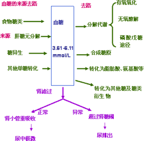

# 第二章　糖代谢紊乱及糖尿病的检查

## 第一节 糖代谢简述

### 一、糖代谢途径
 

#### （一）糖酵解途径：（糖的无氧氧化）
 

##### 1.概念
在无氧情况下，葡萄糖分解生成`乳酸`的过程。
##### 2.反应过程（糖酵解分三个阶段）

###### （1）第一阶段：引发阶段。由葡萄糖生成1，6-果糖二磷酸

   - ①葡萄糖的磷酸化、异构化、再磷酸化生成1，6-果糖二磷酸：
葡萄糖磷酸化成为葡萄糖-6-磷酸，由己糖激酶催化。为不可逆的磷酸化反应，酵解过程关键步骤之一，是葡萄糖进入任何代谢途径的起始反应，消耗1分子ATP。
   - ②葡萄糖-6-磷酸转化为果糖-6-磷酸，磷酸己糖异构酶催化；
   - ③果糖-6-磷酸磷酸化，转变为由6磷酸果糖激酶催化，消耗1分子ATP，是第二个不可逆的磷酸化反应，酵解过程关键步骤之二，是葡萄糖氧化过程中最重要的调节点。

###### 2）第二阶段：裂解阶段。  
1，6-果糖二磷酸折半分解成2分子磷酸丙糖（磷酸二羟丙酮和3-磷酸甘油醛），醛缩酶催化，二者可互变，最终1分子葡萄糖转变为2分子3-磷酸甘油醛。

###### （3）第三阶段：通过氧化还原生成乳酸。（能量的释放和保留）
   - ①3-磷酸甘油醛的氧化和NAD+的还原，由3-磷酸甘油醛脱氢酶催化，生成1，3-二磷酸甘油酸，产生一个高能磷酸键，同时生成NADH用于第七步丙酮酸的还原。
   - ②1，3-二磷酸甘油酸的氧化和ADP的磷酸化，生成3-磷酸甘油酸和ATP。磷酸甘油酸激酶催化。
   - ③3-磷酸甘油酸转变为2-磷酸甘油酸。
   - ④2-磷酸甘油酸经烯醇化酶催化脱水，通过分子重排，生成具有一个高能磷酸键的磷酸烯醇式丙酮酸。
   - ⑤磷酸烯醇式丙酮酸经丙酮酸激酶催化将高能磷酸键转移给ADP，生成烯醇式丙酮酸和ATP，为不可逆反应，酵解过程关键步骤之三。
   - ⑥烯醇式丙酮酸与酮式丙酮酸的互变。
   - ⑦丙酮酸还原生成乳酸。
   

1分子的葡萄糖通过无氧酵解可净生成`2个分子`三磷酸腺苷（ATP），这一过程全部在胞浆中完成。

##### 3.生理意义：
 - （1）是机体在`缺氧或无氧`状态获得能量的有效措施；
 - （2）是某些组织细胞获得能量的方式，如红细胞、视网膜、角膜、晶状体、睾丸、肾髓质等。
 - （3）糖酵解的某些中间产物是脂类、氨基酸等的合成前体，并与其他代谢途径相联系。

#### （二）糖的有氧氧化途径：
 
##### 1.概念
葡萄糖在有氧条件下彻底氧化成水和二氧化碳的过程。
##### 2.过程

有氧氧化可分为两个阶段：

###### 第一阶段：胞液反应阶段：从葡萄糖到丙酮酸，反应过程同糖酵解。

糖酵解产物NADH不用于还原丙酮酸生成乳酸，二者进入线粒体氧化。

###### 第二阶段：线粒体中的反应阶段：
 - （1）丙酮酸经丙酮酸脱氢酶复合体氧化脱羧生成乙酰CoA，是关键性的不可逆反应。  
其特征是丙酮酸氧化释放的能量以高能硫酯键的形式储存于乙酰CoA中，这是进入三羧酸循环的开端。
 - （2）三羧酸循环：  
三羧酸循环是在线粒体内进行的一系列酶促连续反应，从乙酰CoA和草酰乙酸缩合成柠檬酸到草酰乙酸的再生，构成一次循环过程，其间共进行四次脱氢，脱下的4对氢，经氧化磷酸化生成H20和ATP。2次脱羧产生2分CO2。

    **三羧酸循环的特点是：**
   - ①从柠檬酸的合成到α-酮戊二酸的氧化阶段为不可逆反应，故整个循环是不可逆的；
   - ②在循环转运时，其中每一成分既无净分解，也无净合成。但如移去或增加某一成分，则将影响循环速度；
   - ③三羧酸循环氧化乙酰CoA的效率取决于草酰乙酸的浓度；
   - ④每次循环所产生的NADH和FADH2都可通过与之密切联系的呼吸链进行氧化磷酸化以产生ATP；
   - ⑤该循环的限速步骤是异柠檬酸脱氢酶催化的反应，该酶是变构酶，ADP是其激活剂，ATP和NADH是其抑制剂。 

 - （3）氧化磷酸化：  
线粒体内膜上分布有紧密相连的两种呼吸链，即NADH呼吸链和琥珀酸呼吸链。呼吸链的功能是把代谢物脱下的氢氧化成水，同时产生大量能量以驱动ATP合成。1个分子的葡萄糖彻底氧化为CO2和H2O，可生成36或38个分子的ATP。

##### 3.生理意义：
有氧氧化是糖氧化提供能量的主要方式。

#### （三）磷酸戊糖途径：
在胞浆中进行，存在于肝脏、乳腺、红细胞等组织。

##### 生理意义：
 - 1.提供5-磷酸核糖，用于核苷酸和核酸的生物合成。
 - 2.提供NADPH，参与多种代谢反应，维持谷胱甘肽的还原状态等。
#### （四）糖原的合成分解途径：
 - 糖原是动物体内糖的储存形式，是葡萄糖通过α-1，4糖苷键和α-1，6糖苷键相连而成的具有高度分枝的聚合物。
 - 机体摄入的糖大部分转变成`脂肪（甘油三酯）`后储存于脂肪组织内，只有一小部分以糖原形式储存。糖原主要分为`肝糖原和肌糖原`，糖原是可以迅速动用的葡萄糖储备。
 - 糖原合成酶是糖原合成中的关键酶，受G-6-P等多种因素调控。葡萄糖合成糖原是耗能的过程，合成1分子糖原需要消耗2个ATP。
 - 肝脏存在葡萄糖-6-磷酸酶，可使`肝糖原`分解成葡萄糖补充血糖。
 - 肌肉组织`无`葡萄糖-6-磷酸酶，`不能`直接分解成葡萄糖，肌糖原分解产能可供肌肉收缩需要。
#### （五）糖异生：
##### 1.概念
由非糖物质转变为葡萄糖的过程称为糖异生。是体内单糖生物合成的唯一途径。
`肝脏`是糖异生的主要器官，`长期饥饿、酸中毒`时肾脏的异生作用增强。
##### 2.过程：
糖异生的途径基本上是糖酵解的逆向过程，但不是完全可逆过程。酵解过程中三个关键酶催化的反应是不可逆的，故需通过糖异生的4个关键酶（葡萄糖-6-磷酸酶、果糖-1，6-二磷酸酶、丙酮酸羧化酶、磷酸烯醇式丙酮酸激酶）绕过糖酵解的三个能障生成葡萄糖。
##### 3.生理意义：
 - ①补充血糖，维持血糖水平恒定。
 - ②防止乳酸中毒。
 - ③协助氨基酸代谢。
#### （六）糖醛酸途径：
##### 生理意义：
 - 生成有活性的葡萄糖醛酸，它是生物转化中重要的结合剂；
 - 葡萄糖醛酸还是蛋白聚糖的重要组成成分，如硫酸软骨素、透明质酸、肝素等。

### 二、血糖的来源与去路
 - 血液中的葡萄糖称为血糖。空腹时血糖浓度为`3.61～6.11mmol／L`。
 - 血糖恒定的主要意义是保证中枢神经的供能。`脑细胞`所需的能量几乎完全直接来自血糖。
 - 血糖浓度之所以能维持相对恒定，是由于其来源与去路能保持动态平衡的结果。
 - 
#### 1.血糖来源
 
##### （1）糖类消化吸收：
食物中的糖类消化吸收入血，这是血糖最主要的来源。
##### （2）肝糖原分解：
短期饥饿后，肝中储存的糖原分解成葡萄糖进入血液，
##### （3）糖异生作用：
在较长时间饥饿后，氨基酸、甘油等非糖物质在肝内合成葡萄糖。
##### （4）其他单糖的转化。

#### 2.血糖去路
##### （1）氧化分解
葡萄糖在组织细胞中通过有氧氧化和无氧酵解产生ATP，为细胞代谢供给能量，此为血糖的主要去路。
##### （2）合成糖原
进食后，肝和肌肉等组织将葡萄糖合成糖原以储存。
##### （3）转化成非糖物质
转化为甘油、脂肪酸以合成脂肪；转化为氨基酸以合成蛋白质。
##### （4）转变成其他糖或糖衍生物，如核糖、脱氧核糖、氨基多糖等。
（5）血糖浓度高于肾阈（8.9～9.9mmol／L，160～180mg／dl）时可随尿排出一部分。

### 三、血糖浓度的调节
血糖的来源与去路能保持动态平衡受到`神经、激素和器官`三方面的调节作用。
#### 1.激素的调节作用
参与血糖浓度调节的激素有两类：一类是降低血糖的激素，一类是升高血糖的激素，最主要的是胰岛素和胰高血糖素，是调节血糖浓度的主要激素它们对血糖浓度的调节是通过对糖代谢途径中一些关键酶的诱导、激活或抑制来实现的。
##### （1）降低血糖的激素 — 胰岛素：
是最主要的降血糖激素，由`胰岛B细胞（β细胞）`所产生胰岛素作用的部位：肝脏、肌肉组织、脂肪组织

总效应是使血糖去路增加，来源减少，血糖水平降低。
##### （2）胰高血糖素：
是升高血糖浓度的最重要的激素。是由`胰岛A-细胞（α细胞）`合成和分泌的29个氨基酸组成的肽类激素。胰高糖素主要通过提高靶细胞内cAMP含量达到调节血糖浓度的目的。

总效应是使血糖来源增加，去路减少，血糖水平升高。
##### （3）其他升高血糖的激素
 - `糖皮质`激素和`生长`激素主要刺激`糖异生`作用，`肾上腺素`主要促进糖原分解。 这三个激素和胰高血糖素的主要作用是为细胞提供葡萄糖的来源。
 - `胰岛素`和`胰高血糖素`是调节血糖浓度的主要激素 ，而血糖水平保持恒定则不仅是糖本身，还有脂肪、氨基酸代谢的协调作用共同完成。
#### 2.神经系统的调节作用
神经系统对血糖的调节主要通过下丘脑和植物神经系统调节其所控激素的分泌，进而再影响血糖代谢中关键酶的活性，达到调节血糖浓度的作用。

#### 3.肝的调节作用
`肝脏`是维持血糖恒定的关键器官。
肝脏具有双向调控功能，它通过肝糖原的合成、分解，糖的氧化分解，转化为其他非糖物质或其他糖类，以及糖异生和其他单糖转化为葡萄糖来维持血糖的相对恒定。
肝功能受损时，可能影响糖代谢而易出现血糖的波动。

### 四、胰岛素的合成、分泌与调节
#### 1.合成降解
胰岛素是胰岛β细胞分泌的一种由51个氨基酸组成的多肽类激素。
胰岛β细胞首先在粗面内质网生成含102个氨基酸的前胰岛素原，穿过内质网膜，同时切除16个氨基酸的引导序列而成为含86个氨基酸的胰岛素原，当β细胞接受刺激后，β颗粒移向细胞膜，并在蛋白水解酶的作用下，使胰岛素原分解脱下一段含31个氨基酸的C肽和精-赖、精-精两对氨基酸，形成由30个氨基酸残基构成的β链和21个氨基酸残体基构成的α链。

胰岛素分泌时有等分子C肽和少量胰岛素原入血。
C肽无胰岛素的生物活性和免疫性，半寿期15分钟左右。
胰岛素原有3%的胰岛素活性与胰岛素有免疫交叉，正常时有3-5%的胰岛素原未经裂解从β细胞释放。半寿期比胰岛素长。
胰岛素主要由肝脏摄取并降解。半寿期约5min左右。
#### 2.分泌：
最主要生理刺激因子：高血糖
其他如血液中的高氨基酸、脂肪酸、胰高血糖素等，及一些药物也可刺激胰岛素分泌。
胰岛素的基础分泌量为每小时0.5～1.0单位，进食后分泌量可增加3～5倍。
正常人呈脉冲式分泌。
#### 3.作用机制
##### （1）胰岛素发挥作用首先要与靶细胞表面的特殊蛋白受体结合。
胰岛素受体广泛分布于哺乳动物的细胞表面。主要分布于脑细胞、性腺细胞、红细胞和血管内皮细胞。
血糖浓度↑，刺激胰岛β细胞分泌胰岛素
胰岛素 + 受体α亚基→受体变构→激活β亚基蛋白激酶→生物效应
##### （2）胰岛素生物活性效应的强弱取决于：
 - ①到达靶细胞的胰岛素浓度；
 - ②靶细胞表面受体的绝对或相对数目；
 - ③受体与胰岛素的亲和力；
 - ④胰岛素与受体结合后细胞内的代谢变化。
##### （3）胰岛素受体的作用：
 - ①与胰岛素特异地高亲和力地结合；
 - ②转移信息引起细胞内代谢途径的变化。
#### 4.胰岛素的生理作用（前述）

## 第二节　高血糖症和糖尿病

### 一、高血糖症
血糖浓度>7.0mmol／L（126mg／dl）称为高血糖症。
引起高血糖症的原因很多包括：
#### （1）生理性高血糖：
饮食性、情感性、应激情况下可致血糖短期升高（一过性）。
#### （2）病理性高血糖：
 - ①各型糖尿病及甲状腺功能亢进、Cushing病、肢端肥大症、嗜铬细胞瘤等内分泌疾病；
 - ②颅外伤颅内出血，脑膜炎等引起颅内压升高及在疾病应激状态时；
 - ③脱水，血浆呈高渗状态。见于高热，呕吐，腹泻等。
应用某些药物如咖啡因、雌激素、肾上腺素、糖皮质激素等也可引起血糖升高。

### 二、糖尿病及分型
糖尿病（DM）是在多基因遗传基础上，加上环境因素、自身免疫的作用，通过未完全阐明的机制，引起胰岛素相对或绝对不足、或利用缺陷导致以高血糖症为基本生化特点的糖、脂肪、蛋白质、水电解质代谢紊乱的一组临床综合征。
临床典型表现为三多一少（多食、多饮、多尿、体重减少），其慢性并发症主要是非特异和特异的微血管病变（以视网膜、肾脏受累为主，还可见冠心病，脑血管病，肢端坏疽等），末梢神经病变。
ADA（美国糖尿病协会）／WH0主要从病因和发病机理分型，具体标准如下（表3-2-1）：
表3-2-1　　

|ADA/WHO糖尿病分类|
|---|
|**一、1型糖尿病（胰岛β细胞毁坏，常导致胰岛素绝对不足）**|
|1.自身免疫性|
|2.特发性（原因未明）|
|**二、2型糖尿病（不同程度的胰岛素分泌不足，伴胰岛素抵抗）**|
|**三、特异型糖尿病**|
|1.胰岛β细胞遗传性功能基因缺陷|
|2.胰岛素生物学作用有关基因缺陷|
|3.胰腺外分泌病|
|4.内分泌病|
|5.药物或化学品所致糖尿病|
|6.感染所致糖尿病|
|7.少见的免疫介导糖尿病|
|8.糖尿病的其他遗传综合征|
|**四、妊娠糖尿病（GDM）指在妊娠期发现的糖尿病**|

#### (1) 1型糖尿病
指由于胰岛β细胞破坏而导致内生胰岛素或C肽绝对缺乏，临床上易出现酮症酸中毒。
按病因和致病机制分为
自身免疫性：因自身免疫因素导致β胰岛细胞毁坏，胰岛素绝对不足；
特发性：原因至今不明。
##### （1）自身免疫性糖尿病
以前称IDDM，即Ｉ型或青少年发病糖尿病，本型是由于胰岛β细胞发生细胞介导的自身免疫性损伤而引起。

**特点：**
 - ①体内存在自身抗体，如胰岛细胞表面抗体（ICAs）、胰岛素抗体（IAA）、胰岛细胞抗体（ICA）、谷氨酸脱羧酶抗体（GAD）、酪氨酸磷酸酶抗体等。
 - ②任何年龄均发病，好发于青春期，起病较急。
 - ③胰岛素严重分泌不足，血浆C肽水平很低。
 - ④治疗依靠胰岛素
 - ⑤遗传因素在发病中起重要作用如与人类白细胞组织相容性抗原（HLA）等关联性很强，即具有多基因遗传易感性。
环境因素可诱发糖尿病的发生，主要因素有病毒感染、化学物质和食品成分等。有证据表明：某些柯萨奇病毒、腮腺炎病毒、风疹病毒、流感病毒的反复感染可诱导具遗传易感性个体的胰岛β细胞出现原来没有的MHCⅡ类抗原表达，启动自身免疫反应；
食物某些蛋白成分也因与自身抗体分子同源，通过分子模拟效应激发自身免疫反应
##### （2）特发性糖尿病
具有1型糖尿病的表现，而无明显的病因学发现，呈不同程度的胰岛素缺乏，但始终没有自身免疫反应的证据。这一类患者很少，主要来自非洲和亚洲某些种族。
#### (2) 2型糖尿病 以前称NIDDM，即Ⅱ型或成年发病糖尿病。
是多基因遗传背景在多种环境因素的作用下造成不同程度的胰岛素分泌障碍和胰岛素抵抗并存的疾病。此型不发生胰岛β细胞的自身免疫性损伤。
**特点：**
 - （1）患者多数肥胖，病程进展缓慢或反复加重；
 - （2）血浆中胰岛素含量绝对值不降低，但糖刺激后延迟释放；
 - （3）ICA等自身抗体呈阴性；
 - （4）对胰岛素治疗不敏感，初发病人用口服降糖药一般可控制；但有很大一部分患者在在中后期仍需给予外源性胰岛素补充始能控制血糖。
 - （5）有遗传倾向但与HLA基因型无关；
 - （6）很少出现自发性酮症酸中毒。

**按病因和致病机制分三类：**
 - ①胰岛素生物活性降低：胰岛素基因突变使其生物活性降低。
 - ②胰岛素抵抗：是指肝脏和外周脂肪组织、肌肉等对胰岛素的敏感性降低，尤指组织对胰岛素促进葡萄糖摄取作用的抵抗，进而代偿性胰岛素分泌过多导致高血糖伴高胰岛素血症，并由此产生一系列的不良影响和生理改变，成为多种疾病的共同发病基础。
 - ③胰岛素分泌功能异常：胰岛β细胞受到葡萄糖兴奋后不能像正常胰岛β细胞那样产生正常的脉冲式分泌。
#### (3) 特异型糖尿病
按病因和发病机制分为8种亚型：
 - ①β细胞功能遗传性缺陷；
 - ②胰岛素作用遗传性缺陷；
 - ③胰腺外分泌疾病（胰腺手术、胰腺炎、囊性纤维化等）；
 - ④内分泌疾病（甲状腺功能亢进、Cushings病、肢肥大症等）；
 - ⑤药物或化学品所致糖尿病；
 - ⑥感染；
 - ⑦不常见的免疫介导糖尿病；
 - ⑧可能与糖尿病相关的遗传性糖尿病。
属于3、4、5、6亚型的实际上是继发性糖尿病。
#### (4) 妊娠期糖尿病（GDM）
在确定妊娠后，若发现有各种程度的葡萄糖耐量减低或明显的糖尿病，不论是否需用胰岛素或饮食治疗，或分娩后这一情况是否持续，均可认为是妊娠期糖尿病。
妊娠期糖尿病者可能存在某些糖尿病病因，只是在妊娠期间显现出来。
在妊娠结束6周后应再复查，并按血糖水平分为：
 - ①糖尿病； 
 - ②空腹血糖过高；
 - ③糖耐量减低；
 - ④正常血糖。

### 三、糖尿病的诊断标准
1997年ADA／1999年WH0认可，目前国际普遍采用的糖尿病诊断标准：
#### 1.有糖尿病症状加随意血糖≥11.1mmol/L（200mg/dl）
随意血糖浓度：餐后任一时相的血糖浓度。
#### 2.空腹血糖≥7.0mmol/L（126mg/dl）
空腹：禁止热卡摄入至少8小时。
#### 3.口服葡萄糖耐量试验2h血糖≥11.1mmol/L
OGTT采用WH0建议，口服相当于75g无水葡萄糖的水溶液。

注：以上三种方法都可单独诊断糖尿病，其中任何一项出现阳性结果必须随后复查才确诊。

### 四、糖尿病引起的代谢紊乱
#### （一）急性变化
糖尿病会影响到糖、蛋白质和脂肪代谢的改变，表现为高血糖症和糖尿，高脂血症和酮酸血症及乳酸血症等。
##### 1.高血糖症：
糖原合成减少分解增加；
糖异生加强；
肌和脂肪组织对葡萄糖摄取减少。
##### 2.糖尿、多尿及水盐丢失：
（1）血糖过高超过肾糖阈时出现尿糖尿液
（2）渗透性利尿引起多尿及水盐丢失。由于糖尿病患者血中溶质增多（主要为葡萄糖），可有溶质性利尿，排出多量液体而导致严重脱水。
##### 3.高脂血症和高胆固醇血症：
高脂血症为高甘油三脂、高胆固醇、高VLDL的糖尿病性Ⅳ型高脂蛋白血症。
因葡萄糖利用障碍，脂肪组织动员加强，脂肪酸转变成乙酰CoA增多，形成酮体和胆固醇后进入血液。糖尿患者由于存在高脂血症，所以容易伴发动脉粥样硬化。
##### 4.蛋白质合成减弱、分解代谢加速
可有高钾血症，可出现负氮平衡。
##### 5.酮酸血症：
由于肝内酮体产生过多，超过肝外组织的氧化能力时，会形成酮血症和酮尿症。
酮体中乙酰乙酸和β–羟丁酸均为中等强度酸性物质，它们消耗血液缓冲系统而导致代谢性酸中毒。
#### （二）慢性变化
微血管、大血管病变（肾动脉、眼底动脉硬化）、神经病变
 - （1）糖尿病时葡萄糖含量增加经醛糖还原酶和山梨醇脱氢酶催化导致山梨醇和果糖含量增多，
在脑组织→脑细胞内高渗→突然用胰岛素降血糖时→易发生脑水肿；
在神经组织→吸水而引起髓鞘损伤→影响神经传导→糖尿病周围神经炎；

 - （2）高血糖使粘多糖合成增多，在主动脉和较小血管中沉积增加，加之高脂蛋白血症，可促使动脉粥样硬化发生。
 - （3）过多的葡萄糖促进结构蛋白的糖基化→产生进行性糖化终末产物（AGE）→血管基底膜糖化终末产物与糖化胶原蛋白的进一步交联→使基底膜发生形态和功能的障碍→引起微血管和小血管病变。
由于上述变化，糖尿病晚期多并发血管病变，以心、脑、肾诸器官受累最严重，常出现心、肾功能不全和神经系统功能障碍。糖尿病人还易发生多器官淀粉样变，如舌、心脏等淀粉样变。

### 五、糖尿病急性代谢合并症
糖尿病急性代谢合并症包括：糖尿病酮症酸中毒（DKA）、高血糖高渗性糖尿病昏迷（NHHDC）和乳酸酸中毒（LA）。三者可相互合并发生。
低血糖昏迷实际也是糖尿病急性合并症之一，许多病人发生低血糖的原因多与用药不当有关。在糖尿病昏迷中低血糖昏迷相当常见。另外约1／3的病人会同时伴有低血糖。
#### 1.糖尿病酮症酸中毒（DKA）
酮体包括丙酮、乙酰乙酸和β-羟基丁酸。正常人血中酮体为3～23mg／L（酶法），其中β-羟基丁酸占78%，乙酰乙酸占20%，丙酮占2%，三者关系如下：

DKA发病的基本环节是由于胰岛素的缺乏，血糖不能被很好地利用，而引起大量脂肪分解，产生游离脂肪酸和甘油三酯，游离脂肪酸经β-氧化后生成大量乙酰CoA，这些乙酰CoA在肝脏缩合成酮体，酮量的增加超过了周围组织的氧化能力而引起高酮血症。酮体中的乙酰乙酸和β-羟基丁酸都是较强的酸，血酮升高使血中有机酸浓度增高，引起酸血症；
大量有机酸与体内碱基结合成盐从肾脏排出，造成机体碱储备大量丢失，加重了酸中毒；
血pH下降，病人通过换气过度来减低PC02，部分代偿，可出现典型的Kussmanl呼吸，甚至昏迷。
病人的高血糖状态也必然影响渗透压与水电解质平衡。血糖每升高5.5mmol／L，血浆渗透压也必然升高5.5mmol／L，高渗的细胞外液引起细胞内液外移，造成细胞内液减少，细胞脱水。 高糖状态还可引起渗透性利尿，带走水分和电解质引起水电平衡紊乱。

糖尿病酮症酸中毒是严重威胁病人生命的急性合并症之一。死亡率在3.4%～14%。
DKA发病与糖尿病病型密切有关而与病程关系不大。
虽两型都可发生，但仍以1型为多，2型在应激情况下也可发生。
DKA的诱因：感染、停减胰岛素、饮食失调、精神刺激等。
主要症状是：食欲减退、恶心呕吐、无力、头痛头晕，“三多”加重，倦怠，可有腹痛。
主要体征是：脱水症，深大呼吸、呼吸可有酮臭，昏迷，咽、肺部、皮肤常可见感染灶。

实验室检查特点是：
血糖升高，常>16mmol／L（300mg／dl），尿糖强阳性，尿酮体阳性，血清β-羟基丁酸升高，电解质变化不一，多数人在正常范围，部分人可有减低或升高。
血气分析阴离子间隙（AG）升高，PC02降低，pH可降低，血浆渗透压可有升高。
#### 2.非酮症性高血糖高渗性糖尿病昏迷
非酮症性高血糖高渗性糖尿病昏迷的特点是血糖极高，没有明显的酮症酸中毒，是一种因高血糖引起高渗性脱水和进行性意识改变的临床综合征。
在感染、失水和服用某些药物（如糖皮质激素、利尿剂、苯妥英钠、心得安等；）等诱因的刺激下加重了原有的糖代谢紊乱，病人自身胰岛素量不能应付这些诱因造成的对糖代谢负荷的需要，但却足以抑制脂肪分解，因此病人表现为血糖升高，而血酮体并不高。
血浆高渗，水分由细胞内进入细胞外液以维持细胞内外液之间的平衡。
严重的高渗状态必然影响肾的渗透性利尿及对Na+回吸收减低，从而破坏了机体正常的水电解质平衡调节机制。
随着病人大量尿糖引起渗透性利尿而导致的机体失水及Na+、K+等电解质丢失，病人血容量减少，血压下降甚至休克和最终出现无尿。
肾功能损害和脑血组织脱水是威胁病人生命的直接原因。
NHHDC实际发病数约占糖尿病人的5%～10%。多数发生于50岁以上老年人。该病病死率极高，约在15%～20%。
实验室检查特点：血液浓缩，Hb升高，白血球计数升高，血小板计数升高。
血糖极高，>33.6mmol／L（600mg／dl），尿糖强阳性，尿酮体可以阳性，尿比重增高。
电解质变化为：半数人血Na+升高，血K+大多减低，血浆渗透压升高多>350mOsm／（kg·H20），血肌酐与尿素大部分病人升高。

表3-2-2　　　
NHHDC与DKA的鉴别

  表现|NHHDC	|DKA
---|---|---
年龄	|多>40岁，老年人|	多<40岁，年轻人
主要诱因	|感染、缺水、利尿药	|感染、胰岛素或饮食失调
酸中毒症状	|无	|明显
神经系统症状	|明显昏迷，可有病理反射征	|昏迷少见，无病理反射征
脱水表现	|均有明显脱水表现	|60%轻度脱水
血糖	|极高，≥33.6mmol/L	|多数≤33.6mmol/L
有效血浆渗透压	|≥320mOsm/kg H2O	|≤320mOsm/kg H2O
血Na+	|60%病例升高	|多正常
Urea	|升高	|一般正常
血CO2CP	|正常或偏低	|低
尿酮体	|（+）或（—）	|（+）

#### 3.乳酸酸中毒（LA）
正常血乳酸波动在0.6～1.2 mmol／L这一狭窄范围内。

乳酸酸中毒是指病理性血乳酸增高（>5 mmol／L）或PH减低（<7.35）的异常生化状态引起的临床综合征。临床虽不常见，但预后不佳，死亡率高
当血乳酸水平暂时升高而无血pH降低时称为高乳酸血症，如有血pH降低时则为乳酸酸中毒。

许多全身性疾病都能并发LA，其中包括糖尿病，特别是服用双胍类降糖药降糖灵（DBI）的糖尿病人。

糖尿病合并乳酸酸中毒最常见的原因是服用降糖灵（DBI），DBI因增加糖酵解而使乳酸升高，减少糖异生，减少肝和肌肉对乳酸的摄取，减少肾排酸功能而减少乳酸的去路。其引起乳酸酸中毒的死亡率高达50%。

实验室检查特点

是由于酸中毒生理反应所致WBC升高，血乳酸>5 mmol／L，HC03-<20 mmol／L， AG>18mmol／L，血气分析pH<7.35，PCO2下降，PO2可正常或减低，尿素、肌酐、游离脂肪酸，甘油三酯均可升高。
DKA、NHHDC、LA，低血糖症均可引起昏迷，其鉴别要点如下（表3-2-3）：

表3-2-3

昏迷类型|	发作	|病史	|用药史	|体征	|实验室检查
---|---|---|---|---|---
低血糖	|突然	|出汗、心慌、昏厥、性格改变|	胰岛素与优降糖	|瞳孔散大、心跳快、出汗、神志模糊、昏迷	|血糖 <2.8mmol/L  尿糖（一）
DAK	|1～24h|	多尿、口渴、恶心、呕吐、胰岛素注射腹痛|	胰岛素注射	|轻度脱水、Kussmaul呼吸、酮臭	|血糖16～ 33.6mmol/L、尿糖（+ + + +），酮体（+）CO2CP↓
NHHDC|	1～14d	|老年、失水、入量差、40%无糖尿病史	|利尿药、激素、透析	|明显脱水、血压下降、有神经限局体征、多昏迷	|血糖 多>33.6mmol/L、尿糖（+ + + +），酮体（—）、血糖渗透压 多>320mOsm/kg H2O
LA	|1～24h|	有肝肾病史	|DBI	|深大呼吸、皮肤潮红、发热、深昏迷|	血乳酸>5mmol/L、AG>18mmol/L,血酮轻度↑

## 第三节 糖尿病的实验室检查

### 一、血糖测定
血糖测定是检查有无糖代谢紊乱的最基本和最重要的指标。
#### （一）样本：血浆或血清。
血糖测定一般可以测血浆、血清和全血葡萄糖。由于葡萄糖溶于自由水，而红细胞中所含的自由水较少，所以全血葡萄糖浓度比血浆或血清低10%～15%，且受红细胞比容影响。一般来说用血浆或血清测定结果更为可靠。除与标本的性质有关外，血糖测定还受饮食、取血部位和测定方法影响。餐后血糖升高，静脉血糖 < 毛细血管血糖 < 动脉血糖。所以如果不是特殊试验，血糖测定必须为清晨空腹静脉取血。
取血后如全血在室温下放置，血糖浓度每小时可下降5%～7%（约10mg／dl）左右；如立即分离血浆或血清，则可稳定24h。如不能立即检测而又不能立即分离血浆或血清，就必须将血液加入含氟化钠的抗凝瓶，以抑制糖酵解途经中的酶，保证测定准确。
#### （二）方法
##### 1.氧化还原法：（Folin-Wu法）
葡萄糖可使二价铜离子还原为一价铜离子，然后一价铜离子又可和某些化合物显色进行测定。葡萄糖与碱性铜试剂共热与磷钼酸成蓝色钼兰
该法易受血中其他还原糖的干扰，现已淘汰。
##### 2.缩合法：邻甲苯胺法（0-TB法）
利用邻甲苯胺类在酸性环境中可与葡萄糖醛基缩合成葡萄糖基胺，后者脱水生成Schiff氏碱，再经结构重排，生成有色物质。

该法操作简便，灵敏度高，主要缺点是试剂腐蚀性大，邻甲苯胺被怀疑有致癌性，既有碍于健康又易损坏仪器。
以上非酶法均为非特异性方法，由于非糖还原物质，如谷胱甘肽，维生素C、肌酸、肌酐、尿酸等也都能参与反应，可使结果比酶法偏高0.3～0.6mmol／L。
##### 3.酶法：
包括葡萄糖氧化酶-过氧化物酶（GOD-POD）偶联法、己糖激酶（HK）法和葡萄糖氧化酶-氧速率（GOD-OR）法。

酶法采用特定的酶促生化反应步骤，因此具有特异性高。

- （1）葡萄糖氧化酶-过氧化物酶偶联法（GOD-POD法）：目前应用最广泛的常规方法。

POD：过氧化物酶 GOD：葡萄糖氧化酶
505nm比色，其色泽深浅与葡萄糖浓度成正比。
评价：准确度、精密度、灵敏度和稳定性良好是目前血糖测定的首选方法。
GOD催化的反应特异，只有葡萄糖反应，POD不特异受干扰因素较多，如血中有还原性物质，如尿酸、维生素C、胆红素和谷胱甘肽等可使H202还原为H2O，可致结果偏低。
- （2）葡萄糖氧化酶-氧速率法（GOD-OR法）：
葡萄糖氧化酶每氧化标本中的一分子葡萄糖便消耗一分子氧，用氧敏感电极测定氧消耗速率，便可知葡萄糖含量。此法准确性和精密度都很好，但只能用于特殊的分析仪。
- （3）已糖激酶法（HK法）：是目前公认的参考方法。

NADPH在340nm有吸收峰，其吸光度增加与葡萄糖浓度成正比。
该反应第一步不特异，任何己糖均可参与，第二步特异，只有G-6-P才能反应。
评价：本法准确度和精密度高，特异性高于葡萄糖氧化酶法。干扰因素少，轻度溶血、脂血、黄疸、肝素、EDTA等不干扰测定。
试剂较贵。
#### （三）参考值
3.61～6.11 mmol／L（65～110mg／dl）

#### （四）临床意义
##### 1.诊断高血糖症和糖尿病：
血糖浓度>7.0mmol／L（126mg／dl）称为高血糖症。引起高血糖症的原因很多，有生理性和病理性。
##### 2.诊断低血糖症：
血糖浓度<2.8mmol／L（50mg／dl），称为低血糖症。引起低血糖的原因很复杂，主要有：空腹低血糖、反应性低血糖、药物引起的低血糖等后述。

### 二、尿糖测定
#### （一）概述
正常人尿糖定性为（-），24h尿中排出的葡萄糖少于0.5g。
当血糖浓度超过肾糖阈时，可在尿中测出糖。尿中可测出糖的最低血糖浓度（8.82～9.92mmol／L）称为肾糖阈。
尿糖测定主要用于筛查疾病和疗效观察而不作为诊断指标。
因为随着肾小球和肾小管情况的不同，肾糖阈会有变化，一般情况下糖尿病人血糖越高，尿糖也越多，可以从尿糖反映一定时间内葡萄糖从尿中流失的情况，但评价尿糖时一定要考虑肾糖阈的因素。
#### （二）方法：
##### ⒈班氏定性试验
利用葡萄糖或其它还原性物质在碱性高温环境中，将反应液中Cu2+还原为亚铜离子Cu+，形成黄色的氢氧化亚铜或红色的氧化亚铜。
##### 2.葡萄糖氧化酶试纸法（干化学法）
反应原理同血糖葡萄糖氧化酶法。

尿中的葡萄糖被试条中所含的葡萄糖氧化酶氧化生成葡萄糖醛酸和H2O2，后者在过氧化物酶的催化下释放出氧，并使试条中的色原物氧化显色。根据显色的程度，可对尿葡萄糖作定性及半定量检测。
#### （三）参考值
尿糖试纸半定量法（-）：24h尿糖定量（葡萄糖氧化酶法）：<0.5g／24h。
#### （四）临床意义
##### 1.血糖增高性糖尿
如糖尿病、甲状腺机能亢进、肢端肥大症、肾上腺瘤等。
糖尿病人在胰岛素治疗中用于指导调整药量，24h尿糖定量对判断糖尿病的程度和指导用药较尿糖定性更为准确。
##### 2.血糖正常性糖尿
 - （1）肾糖阈降低所致的肾性糖尿，如家族性糖尿；
 - （2）因细胞外液容量增加，近曲小管重吸收受抑制，如妊娠；
 - （3）肾小管重吸收功能受损，如慢性肾炎或肾病综合征。
##### 3.暂时性糖尿
 - （1）超过肾糖阈的生理性糖尿，如食入碳水化合物过多；
 - （2）应激性：如脑外伤、脑血管意外、急性心肌梗死等。
##### 4.其它糖尿
乳糖、半乳糖、果糖、甘露糖等，进食过多或代谢障碍，如肝硬化时，也可从尿中排出。
#### （五）注意事项
 - 1.妊娠、哺乳期可出现乳糖尿，大量吃水果，出现果糖尿可使班氏法尿糖阳性；
 - 2.了解病人从尿中丢失糖的情况，要求至少固定饮食条件一周后测定24小时尿糖，测定时先用定性法估计大概量，再用蒸馏水稀释至小于300mg／dl（+++）测定。
 - 3.尿糖定性可受尿量影响，尿少加号多，尿多加号少。有的糖尿病人经过治疗后血糖下降，可尿糖不见下降，这是因为经治疗后病人不渴，无渗透性利尿，尿中水少了，所以加号不少。
 - 4.葡萄糖氧化酶法是靠生成过氧化氢使色原显色。尿中其他还原剂使过氧化氢变为水，造成结果假阴性。

### 三、口服葡萄糖耐量实验（OGTT）
#### （一）概述
##### 1.糖耐量
指人体对摄入的葡萄糖具有很大耐受能力的现象。
口服葡萄糖耐量试验： 口服一定量葡萄糖后，每间隔一定时间测定血糖水平称之。
是一种葡萄糖负荷试验。利用这一试验可了解胰岛β细胞功能和机体对糖的调节能力。
##### 2.OGTT的主要适应证
 - ①无糖尿病症状，随机或空腹血糖异常者；
 - ②无糖尿病症状，有一过性或持续性糖尿；
 - ③无糖尿病症状，但有明显糖尿病家族史；
 - ④有糖尿病症状，但随机或空腹血糖不够诊断标准；
 - ⑤妊娠期、甲状腺功能亢进、肝病、感染，出现糖尿者；
 - ⑥分娩巨大胎儿的妇女或有巨大胎儿史的个体；
 - ⑦不明原因的肾病或视网膜病。
#### （二）方法
WHO标准化的OGTT：
WHO推荐成人75g葡萄糖，孕妇100g，儿童每公斤体重1.75g，总量≤75g用250ml水溶解，5分钟内口服。服糖前抽空腹血，服糖后每隔30分钟取血，共四次。采血同时每隔1小时留尿测尿糖。根据各次血糖水平绘制糖耐量曲线。
试验前三天每日食物中糖含量应不低于150 g，维持正常活动，影响试验的药物应在三天前停用。整个试验期间不可吸烟、喝咖啡、喝茶或进食。
#### （三）OGTT结果：
##### 1.正常糖耐量：
空腹血糖<6.1mmol／L（110mg／dl），口服葡萄糖30min～60min达高峰，峰值<11.1mmol／L（200mg／dl）；2小时恢复到正常水平，即<7.8mmol／L（140mg／dl），尿糖均为（—）。
此种糖耐量曲线说明机体糖负荷的能力好。
##### 2.糖尿病性糖耐量：
空腹血糖浓度≥7.0mmol/L；
服糖后血糖急剧升高，峰时后延峰值超过11.1mmol/L，2小时后仍高于正常水平
尿糖常为阳性。
其中服糖后2h的血糖水平是最重要的判断指标。
许多早期糖尿病病人，可只表现为2小时血糖水平的升高。
糖尿病人如合并肥胖、妊娠、甲状腺功能亢进，使用糖皮质醇激素治疗或甾体避孕药时，可使糖耐量减低加重。

##### 3.糖耐量受损（IGT）：
空腹血糖6.11～7.Ommol／L（110～126mg／dl），
2小时后血糖水平：7.8mmol/L ≤ 2h血糖 ＜11.1mmol/L
IGT病人长期随诊，最终约有1／3的人能恢复正常，1／3的人仍为糖耐量受损，1／3的人最终转为糖尿病。
##### 4.其他糖耐量异常
 - （1）平坦型耐糖曲线：

特征：
 - ①空腹血糖水平正常；
 - ②服糖后不见血糖以正常形式升高。不出现血糖高峰，曲线低平；
 - ③较短时间内（一般1小时内）血糖即可恢复原值。

原因：可由于胃排空延迟，小肠吸收不良引起。或脑垂体、肾上腺皮质功能减退、甲状腺功能减退及胰岛素分泌过多等引起。此时由于糖异生作用降低，组织对糖的氧化利用加强而表现为糖耐量增加。

 - （2）储存延迟型耐糖曲线：
   - 特征：服糖后血糖水平急剧升高，峰值出现早，且超过11.1mmol／L，而2h值又低于空腹水平。
   - 原因：胃切除病人于肠道迅速吸收葡萄糖或严重肝损害的病人肝脏不能迅速摄取和处理葡萄糖而使血糖升高，引起反应性胰岛素分泌增多，进一步致肝外组织利用葡萄糖加快，使2h血糖明显降低。
#### （四）注意事项
1.OGTT受多种因素影响，如年龄、饮食、健康状况、胃肠道功能、某些药物和精神因素等。
假阳性可见于营养不良、长期卧床、精神紧张、急慢性疾病；
口服避孕药、糖皮质激素、甲状腺激素、烟酸、苯妥英钠、利尿剂及单胺氧化酶抑制剂者。

2.对于胃肠道手术或胃肠功能紊乱影响糖吸收的患者，糖耐量试验不宜口服进行，而需采用静脉葡萄糖耐量试验（IGTT）。
对0GTT正常但有糖尿病家族史者，可进行可的松0GTT，但50岁以上者对葡萄糖的耐受力有下降的趋势，所以不宜做此类试验。

### 四、糖化蛋白测定
血中的己糖，特别是葡萄糖，可以和蛋白质发生缓慢的不可逆的非酶促反应，形成糖基化蛋白。合成的速率与血糖的浓度成正比，直到蛋白质降解后才释放，故能持续存在于该蛋白质的整个生命中。

血红蛋白、清蛋白、晶状体蛋白、胶原蛋白等都可发生糖基化反应，糖化后的蛋白可变性，是引起DM慢性并发症的原因之一。

由于不同蛋白质的半寿期不同，所以可以通过对不同糖基化蛋白质的测定了解糖尿病治疗过程中的血糖水平，作为糖尿病控制与否的一个监测指标，不用于糖尿病的诊断。由于糖化蛋白与糖尿病血管合并症有正相关，所以可用此指标估计血管合并症发生的危险度。

#### （一）糖化血红蛋白测定

##### 1.Hb的种类：
GHb是HbA1合成后化学修饰的结果。GHb形成取决于血糖浓度及血糖与Hb的接触时间，生成量与血中葡萄糖浓度成正比，其糖化反应过程缓慢且相对不可逆（GHb一旦形成不再解离）。
最重要的是HbA1c。HbA1c的生成量取决于血糖的浓度，正常人约占4%～6%。由于红细胞的半寿期是60天，所以GHb的测定可以反映测定前8周左右病人的平均血糖水平。
##### 2.测定方法：
高压液相色谱（HPLC）法（参考方法）
可精确分离HbA1各组分；并分别得出HbA1a、HbA1b、HbA1c、HbA1d的百分比，
阳离子交换柱层析法CV（2%～16%），测定的血红蛋白类型为HbA1
参考值：HbA1c 4%～6%（HPLC法）
##### 3.临床意义：
 - （1）可鉴别糖尿病性高血糖及应激性高血糖，前者GHb水平多增高，后者正常。

新糖尿病患者，血糖水平增高，GHb不明显增多；
未控制的糖尿病病人，GHb升高可达10%～20%，
糖尿病被控制和血糖浓度下降后，GHb缓慢下降，常需数周。
GHb测定反映测定前8周左右（2～3个月）病人血糖的总体变化，不能反映近期血糖水平，不能提供治疗的近期效果。
 - （2）用于评定糖尿病的控制程度。

糖尿病控制不佳时GHb可升高至正常2倍以上，按美国糖尿病学会推荐糖尿病治疗中血糖控制标准为<6.67mmol／L（120mg／dl），GHb为<7%。
糖尿病控制好者可2～3个月测一次，控制欠佳者1～2个月测一次，妊娠糖尿病（特别是1型糖尿病），每月测一次，以便调整用药，使病情得到最好控制。
若GHb大于10%，胰岛素剂量就需要调整。对监护中的糖尿病人，其GHb浓度改变2%就有明显的临床意义可以说明血糖控制的好与坏。
 - （3）判断预后，研究糖尿病血管合并症与血糖控制关系的指标。

GHb为8%～10%表明病变为中等程度；若>10%为严重病变，易发生糖尿病血管合并症；
妊娠期还可致畸，引起死胎和先兆子痫。
 - （4）糖尿病伴红细胞更新率增加、贫血、慢性失血、尿毒症者（红细胞寿命缩短）均可导致GHb降低；
糖尿病伴血红蛋白增加的疾病可使GHb增加。

#### （二）糖化血清蛋白测定
血清白蛋白和其他蛋白质也可与葡萄糖发生糖基化反应，生成酮胺结构，称为果糖胺。
白蛋白的半寿期比血红蛋白短，转换率快，约17～19天，可通过测定血清糖基化蛋白水平来反映2～3周前的血糖控制情况，制定控制糖尿病人血糖浓度的短期方案。
##### 1.方法：硝基四氮唑蓝法

还可采用酮胺氧化酶（KAO）法。即：

参考值：
NBT法：<285μmol／L（以14C标化的糖化白蛋白为标准参照物）
酮胺氧化酶法：122～236μmol／L
##### 2.临床意义：
反映2～3周前的血糖控制水平，作为糖尿病近期内控制的一个灵敏指标，能在短期内得到治疗效果的回馈，特别适用于住院调整用药的病人。
当病人血浆蛋白降低时（≤35g／L）该项试验即不可靠。
不同的生化指标可以反映血糖水平时间的长短不同，一般来说时间由长到短的排列是
糖化终末产物 > 糖化血红蛋白 > 果糖胺 > 血糖

### 五、葡萄糖-胰岛素释放试验
#### 1.概述
通过观察在高血糖刺激下胰岛素的释放可帮助我们了解胰岛β细胞的功能。
糖尿病人往往可出现胰岛素空腹水平低下，或服糖后胰岛素释放与血糖不同步，高峰后移或胰岛素升高水平不够等现象。
#### 2.方法
实验前后的准备同GOTT，如已知为糖尿病人则选用馒头餐代替口服葡萄糖。取血同时进行葡萄糖和胰岛素测定。

胰岛素测定过去一般采用放射免疫竞争双抗体-PEG法。用125Ⅰ标记的胰岛素与标本中胰岛素一起竞争结合抗胰岛素抗体上的结合位点，再用第二抗体结合抗胰岛素抗体，以PEG沉淀胰岛素与双抗体的复合物，并测定沉淀物的放射性计数，计数的高低与标本中胰岛素的含量成反比。

现在多采用化学发光法。即标本中的胰岛素和包被于固相磁珠或固相上的单克隆抗体及标记有酶或电化学发光物质的单克隆抗体形成双抗体夹心复合物，通过磁场或冲洗除去未反应的标记单克隆抗体，加入酶底物使之显色或通电使电化学发光物质形成激发态并在衰减时发射光子，底物显色强度或发光强度与胰岛素含量成正比。此外还可采用双位点的时间分辨荧光计测定法。
#### 3.参考值
空腹胰岛素35～145pmol／L（化学发光法），5～25 μU／ml（RIA法）
胰岛素峰时在30min～60min，峰值达基础值的5～10倍，180min时降至空腹水平。
胰岛素曲线一般与糖耐量曲线的趋势平行。
#### 4.临床意义
 - （1）胰岛素水平降低常见于1型糖尿病，空腹值常<5 μU／ml，糖耐量曲线上升而胰岛素曲线低平。
 - （2）胰岛素水平升高可见于2型糖尿病，病人血糖水平升高，胰岛素空腹水平正常或略高，胰岛素释放曲线峰时出现晚，约在120min～180min，峰值高于正常体重者，低于同体重者，峰高倍数降低。其原因可能是病人体内存在胰岛素拮抗物或靶细胞的胰岛素受体数目减少或胰岛素清除率降低。胰岛素持续升高，而血糖持续低平则见于胰岛β细胞瘤；
胰岛素持续升高，而血糖水平正常见于早期糖尿病。空腹血糖正常的轻型糖尿病人常表现为迟发的高胰岛素水平和低血糖现象。
高胰岛素血症还见于肥胖、高血压、皮质醇增多症等胰岛素抵抗者。

### 六、葡萄糖-C肽释放试验
#### （一）概述
糖尿病人胰岛素水平相对或绝对不足的原因比较复杂，若病人接受过胰岛素治疗6周后则可产生胰岛素抗体，这时测定胰岛素常不能反映病人体内胰岛素的真实水平。

由于胰岛β细胞在分泌胰岛素的同时也等分子地释放C肽，测定C肽比胰岛素有更多优点：

C肽与外源性胰岛素无抗原交叉，且生成量不受外源性胰岛素影响；

很少被肝脏代谢，所以C肽的测定可以更好地反映β细胞生成和分泌胰岛素的能力。
#### （二）方法
C肽测定可采用放射免疫分析法，125Ⅰ-C肽和样品中的C肽与有限量的抗C肽抗体竞争结合位点，经4℃孵育24h反应达到平衡后加入分离试剂，与抗体结合的C肽形成沉淀，离心分离未结合的C肽，将沉淀物进行放射计数，数值的大小与C肽含量成反比。

也可采用化学发光法，即标本中的C肽和包被于固相磁珠上的单克隆抗体及标记有酶的单克隆抗体形成双抗体夹心复合物，在磁场中除去未反应的标记单克隆抗体，加入酶底物使之显色，底物显色强度与C肽含量成正比。
#### （三）参考值
空腹C肽0.4nmol／L（1.0±0.23ng／ml），
峰时在30～60min，峰值达基础值的5～6倍以上。
#### （四）临床意义

 - 1.C肽测定常用于糖尿病的分型，它与胰岛素测定的意义是一样的。

1型糖尿病由于胰岛β细胞大量破坏，C肽水平低，对血糖刺激基本无反应，整个曲线低平；2型糖尿病C肽水平正常或高于正常；服糖后高峰延迟或呈高反应。

 - 2.确认需胰岛素治疗的DM患者：

如口服75克葡萄糖后，胰岛素水平＞60 μU/ml,发生微血管并发症概率小，可靠饮食控制；胰岛素水平＜ 40 μU/ml,需胰岛素治疗，发生微血管并发症概率大。所以可协助确定病人是否继续使用胰岛素还是只需口服降糖药或饮食治疗。

 - 3.用于低血糖的诊断与鉴别诊断，特别是医源性胰岛素引起的低血糖；

对胰岛移植和胰腺移植的病人，C肽测定可以了解移植是否存活和β细胞的功能；
C肽测定还可以用于胰腺肿瘤治疗后复发与否的诊断。

 - 4.C肽和胰岛素同时测定，可帮助了解肝脏的变化

因为胰岛素每次血循环都被正常肝脏降解一半，C肽很少被肝代谢，测定外周血C肽／胰岛素比值，可以估计肝脏处理胰岛素的能力。

### 七、糖尿病急性代谢合并症的实验室检查
#### （一）酮体测定
##### 1.方法：
最常用的是硝普盐半定量试验。乙酰乙酸和丙酮与硝普盐（亚硝基铁氰化钠）在碱性条件下可生成紫色化合物，生成量与酮体的含量成正比。

##### 2.参考值：
血酮体（-）（<5 mmol／L）
尿酮体（-）
##### 3.临床意义：
是一种简便易行的筛选试验。
目前已做成试纸条，灵敏度达25～50mg／dl，线性范围达1600mg／dl，但这种方法完全不能测出β-羟基丁酸。测丙酮的灵敏度也比乙酰乙酸小5～10倍。当血清酮体浓度<5mmol／L时，就很难测出丙酮的含量。
#### （二）β-羟基丁酸测定
在酮体中β-羟基丁酸占78%，而且在糖尿病酮症发生早期，β-羟基丁酸就可有明显升高，此时乙酰乙酸尚无明显变化。
所以测定乙酰乙酸的硝普盐试验常引起临床对总酮量和酮症程度的低估；

在酮症恢复期，β-羟基丁酸迅速下降时，乙酰乙酸在一定时间内仍然保持升高或下降缓慢，这时用硝普盐法又会引起临床对病情的高估。
因此，β-羟基丁酸的测定在糖尿病酮症的诊断、治疗监测中比乙酰乙酸测定更灵敏，更可靠，同样在糖尿病控制的预告中也非常有价值。
##### 1.方法：
β-羟基丁酸测定，采用酶动力学连续监测法，其反应式为：
BHB: β-羟基丁酸 β-HBDH: β-羟基丁酸脱氢酶
在pH8.5时测定340nm波长下NADH吸光度上升的速率，与BHB的浓度威正比。
##### 2.参考值：
血β-羟基丁酸＜0.27mmol／L
##### 3.临床意义：
血或尿酮体阳性多见于糖尿病酮症酸中毒。此外还见于妊娠剧吐，长期饥饿，营养不良，剧烈运动后或服用双胍类降糖药等。
#### （三）乳酸测定（LA）
##### 1.方法
血乳酸分析采用酶动力学连续监测法。反应式如下：

L-Lactic Acid：乳酸 LD：乳酸脱氢酶 Pyruvate：丙酮酸
在pH9.8时，反应平衡趋向乳酸盐氧化为丙酮酸盐方向，若加入L-谷氨酸，使之与丙酮酸反应随时除去反应产物，则使反应进一步向右移动。在340nm测定生成的NADH吸光度上升速率与样品中乳酸浓度成正比。
##### 2.参考值
<2mmol／L。
##### 3.临床意义：
乳酸升高见于糖尿病酮症酸中毒，肾衰竭，呼吸衰竭，循环衰竭等缺氧和低灌注状态。
当乳酸>5mmol／L时称为乳酸酸中毒。乳酸酸血症的严重程度常提示疾病的严重性。
当血乳酸水平>10.5mmol／L时存活率仅有30%。对于血气分析无法解释的代谢性酸中毒，可用乳酸测定来检测其代谢基础。
16～17题共用题干
某糖尿病人急诊入院，呕吐2天，有困倦，呼吸深、快，有特殊气味

## 第四节　低血糖症

### 一、概述
#### （一）概念：
低血糖不是一个独立的疾病，而是由于某些病理和生理原因使血糖降低至生理低限以下（通常<2.8mmol／L（50mg／dl））的异常生化状态引起以交感神经兴奋和中枢神经系统异常为主要表现的临床综合征。

正常情况下，餐后血糖可以稍高，但很少>8.3mmol／L；饥饿时很少<3.3mmol／L。两餐间血糖水平主要靠肝脏的内生血糖维持。血糖恒定的主要生理意义是保证中枢神经的供能。脑组织和其他组织的细胞不同，它本身没有糖原储备。脑细胞所需的能量几乎完全直接来自血糖。中枢神经细胞每分钟约需1OOmg（2.2mg／kg·min）葡萄糖，一天为14.4g糖，这就超过了肝脏可初步动员的糖原储备量，因而必须靠定时的饮食进行补充。

在低血糖调节时，除了前面所说的血糖调节机制外，葡萄糖反调节系统起着重要作用。

胰岛素是主要的降糖因子，它与许多升高血糖的反调节因子共同构成一个调节糖代谢的安全系统，该系统中一个或多个部分功能受损，其他部分可以互补或代偿；

减少胰岛素分泌对预防和纠正低血糖最重要。
#### （二）低血糖症状：
低血糖症状是指脑缺糖和交感神经兴奋两组症状。

脑缺糖可引起大脑皮层功能抑制，皮质下功能异常，病人有头痛、焦虑、精神不安以致神经错乱的表现，全身或局部性癫痫甚至昏迷、休克或死亡；

血糖下降引起交感神经兴奋、大量儿茶酚胺释放，病人感到饥饿、心慌、出汗，面色苍白和颤抖。这些症状与血糖下降快慢有关，血糖急性下降症状明显，缓慢下降症状轻或不明显。反复发作的慢性低血糖造成的脑组织损害可致病人痴呆。
#### （三）分类：
根据低血糖发作的特点和原因，可分为空腹低血糖、反应性低血糖、药物引起的低血糖三类。
##### 1.空腹低血糖的原因及分类
 - （1）内分泌性低血糖
   - 1）胰岛素或胰岛素样物质过多
   - a.胰岛细胞瘤（包括良性、恶性与增生）、胰管细胞新生胰岛；
   - b.胰外肿瘤、中胚层发生的各种肉瘤、腺癌。
 
 - 2）升高血糖的激素缺乏
   - a.胰岛α细胞分泌胰高血糖素减少；
   - b.垂体前叶功能减退；
   - c.肾上腺皮质功能低下；
   - d.甲状腺功能低下。
 - （2）肝源性低血糖
   - 1）严重肝细胞损害： 肝癌、肝硬化、肝炎（暴发性、中毒性）、胆管炎、胆汁淤积、心衰所致肝淤血
   - 2）先天性肝酶系异常：糖原代谢酶、糖异生酶、糖原合成酶缺乏。
 
 - （3）肾源性低血糖
   - 1）肾性糖尿。
   - 2）肾功能衰竭晚期（非透析引起）。
 
 - （4）过度消耗或摄入不足：
   - 长期饥饿、剧烈运动、透析失糖、慢性腹泻、长期发热、哺乳、妊娠、吸收不良。
 
 - （5）其他：
   - 自身免疫性低血糖、酮症性低血糖、Reye综合征、败血症。
   
空腹低血糖的反复出现，常提示有特殊的器质性疾病，其中最常见的原因是胰岛β细胞瘤，也称胰岛素瘤。

**胰岛β细胞瘤的主要临床特点是**
 - ①常于清晨空腹或餐后4～5h发作不能自行缓解，饥饿或运动可引起低血糖发作。
 - ②脑缺糖的表现比交感神经兴奋症状更明显，半数以上病人表现有嗜睡甚至昏迷。
 - ③有约30%病人进食可以缓解症状和预防发作，故频繁进食以致肥胖。

实验室检查应首先确定病人是否有空腹低血糖发作。如空腹或发作时血糖<2.8mmol／L，OGTT曲线低平，胰岛素或C肽水平相对高于正常，支持诊断。对没有典型低血糖发作的可疑病人需要进一步做其他检查。

##### 2.反应性低血糖症
反应性低血糖症空腹时血糖并无明显降低，往往是遇到适当刺激后诱发（如进食）。
一般不意味着有明确的病理性、器质性改变，常为功能性。
但非绝对，有些器质性疾病如胰岛β细胞瘤，甲状腺素或肾上腺皮质激素缺乏亦可有餐后低血糖。

按病史和0GTT可分为三型。
 - （1）特发性餐后（功能性）低血糖：
是反应性低血糖中最常见者。约占70%，多在进食后2～4h发作，尤其是进食含糖饮食后，出现无力，心慌、饥饿、出汗和头痛等症状。确切发病机制还不清楚。有研究表明患者细胞对胰岛素的反应或对胰岛素受体敏感性增高，而胰高血糖素的分泌和作用降低。肾上腺素分泌的代偿导致餐后交感神经症状产生。病人血胰岛素水平往往正常。功能性低血糖多见于30岁至40岁中年女性，病人多有神经质和精神紧张，实验室和体格检查多正常。

诊断依据：
 - ①有餐后低血糖症状，自觉症状明显，但无昏迷和癫痫，一般半小时左右可自行恢复。
 - ②延长OGTT时，空腹和第一小时血糖正常，第2h～3h降至过低值，以后可恢复正常。
 - ③饥饿试验能够耐受，无低血糖发作。
 - ④胰岛素水平及胰岛素／血糖比值正常。
 - ⑤对低糖、高蛋白质饮食有效。
 - ⑥无糖尿病、胃肠手术等病史。
 - （2）营养性低血糖：
多发生在进食2h～3h。
 - 病人有胃切除、胃肠切除、幽门成形术、胃造瘘术史。由于饮食快速由胃排空进入小肠，大量葡萄糖吸收引起迷走神经反射过度兴奋和胃肠激素过度分泌刺激胰岛β细胞一时性大量分泌胰岛素和急性低血糖发作所致。大量胰岛素的作用引起血糖快速下降，导致交感神经兴奋，大量儿茶酚胺释放而出现一系列低血糖症状。

诊断依据:
 - ①有胃、肠手术史。
 - ②有餐后低血糖症状。
 - ③OGTT出现储存延迟型耐糖曲线。
 - ④低糖、高蛋白，少量、多餐、慢食有效。
（3）2型糖尿病或糖耐量受损伴有的低血糖：
是糖尿病早期表现之一。多见于50岁以下NIDDM病人发生的餐后晚期低血糖。原因是由于胰岛素细胞对高血糖引起的胰岛素释放反应延迟所致。病人多肥胖，可有糖尿病或家族史。
诊断依据:
 - ①空腹血糖正常，
 - ②OGTT前2h似糖耐量受损或Ⅱ型糖尿病的表现。如1h血糖高于正常人1h数值，但3h～5h血糖却可降至<2.8mmol／L。
##### 3.药物引起的低血糖
目前至少已知20多种药物可引起低血糖。
比较常见的药物及原因有：
 - ①胰岛素的使用不当，如剂量不准，剂型不适，未按时进餐，饮酒（内源性糖生成减少），剧烈运动，热水浴及慢性肾功能不全（胰岛素清除率下降）等；
 - ②口服降糖药，特别是磺脲类（优降糖）对初用的老年人容易诱发低血糖，其病死率为10%，而约5%生存者伴永久性神经损伤。故初剂量不宜过大。
 - ③水杨酸盐类（4～6g／24h时）。本身有降糖作用，同时又有加强磺脲类降糖的作用，具体机制不清。主要可引起儿童低血糖。
 - ④乙醇因代谢产生乙醛和乙酸消耗糖异生的关键因子NAD抑制糖异生，易引起肝糖原储备耗竭；同时还抑制皮质激素、生长激素、肾上腺素对低血糖的反应，故大量饮酒，特别是空腹饮酒可引起酒精性低血糖。
 - ⑤其他可引起低血糖的药物尚有心得安、磺胺类、对氨基苯磺酸、四环素等。

### 二. 低血糖的实验室检查
血糖测定、OGTT试验、胰岛素及C肽测定是低血糖检查的常用项目。

### 三.低血糖的诊断
由于低血糖的临床表现没有特异性，其诊断指标是：不论何原因
 - 1.有低血糖的症状（应注意低血糖的症状和血糖降低的速度有关，降低速度快者症状明显）；
 - 2.发作时血糖≤2.8mmol／L（60岁以上老人≤3.0mmol／L）；
 - 3.给予葡萄糖后低血糖症状可消除。
具备以上三条可诊断为低血糖症。

## 第五节　糖代谢先天性异常

### 一、糖原代谢异常
糖原代谢异常最常见的是糖原贮积病，这是由于糖原生成和分解的酶系统先天性缺陷所致，使糖原在细胞中过多贮积或糖原分子异常。由于缺陷的酶不同，故糖原贮积病分为许多型。

### 二、糖分解代谢异常
糖分解代谢途径先天代谢异常可有：
#### 1.丙酮酸激酶（PK）缺乏病
成熟红细胞中不含线粒体，完全依赖糖酵解供能。在糖酵解过程中，丙酮酸激酶催化磷酸烯醇式丙酮酸生成烯醇式丙酮酸，同时产生ATP，用于维持红细胞内外的离子梯度，特别是通过Na+-K+ATP酶维持细胞内外Na+-K+浓度梯度，以维持红细胞膜的完整性。PK缺乏将导致ATP生成障碍，红细胞发生肿胀，进而发生溶血。
#### 2.丙酮酸脱氢酶复合物缺乏症
丙酮酸脱氢酶复合物由三种酶，五种辅助因子组成

三种酶：丙酮酸脱氢酶、二氢硫辛酸转乙酰基酶、二氢硫辛酸脱氢酶；

五种辅助因子：NAD+、FAD、CoASH、焦磷酸硫胺素，硫辛酸。

该酶复合物中各种亚基都可能发生先天性缺陷，这些缺陷都可使丙酮酸不能继续氧化产生ATP，使脑组织不能有效地利用葡萄糖供能，进而影响了儿童大脑的发育和功能，严重者可导致死亡。丙酮酸不能进一步氧化，致使患儿血液中乳酸，丙酮酸和丙氨酸的浓度显著升高，出现慢性乳酸酸中毒。
#### 3.磷酸果糖代谢异常
磷酸果糖激酶与果糖1，6-二磷酸酶是作用相反的一对酶，它们所催化的化学反应是糖代谢途径中的一处无效循环（底物循环），由于酶的遗传性缺陷，这个无效循环得不到控制，造成ATP大量分解产热。临床上可因吸入氟烷诱发恶性发热。

### 三、G-6-PD（6-磷酸葡萄糖脱氢酶）缺陷
G-6-PD为X伴性遗传。G-6-PD催化磷酸戊糖途径的关键反应：

6-磷酸葡萄糖脱氢生成6-磷酸葡萄糖内脂，脱下的氢由NADP+接受，产生NADPH。

NADPH在维持红细胞的正常形态与功能方面起重要作用。

一般情况下磷酸戊糖途径提供的NADPH还能维持还原型谷胱甘肽的水平，保证红细胞的正常形态与功能，当红细胞中NADPH的需要量增加，如服奎宁类抗疟疾药时，G-6-PD缺乏患者红细胞中磷酸戊糖途径的代谢速度则不能相应增加，提供的NADPH不能保证维持还原型谷胱甘肽所应有的水平，可引起严重的溶血性贫血。

NADPH还是体内许多合成代谢的供氢体并参与体内的羟化反应，与生物合成或生物转化有关。