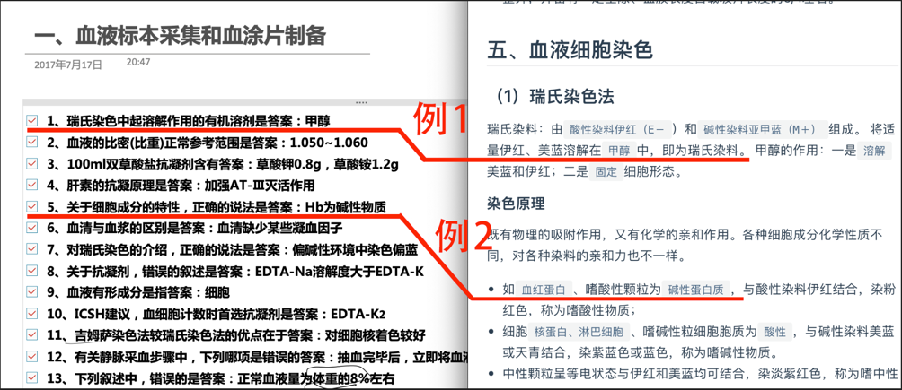
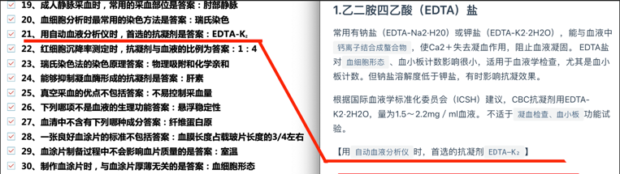
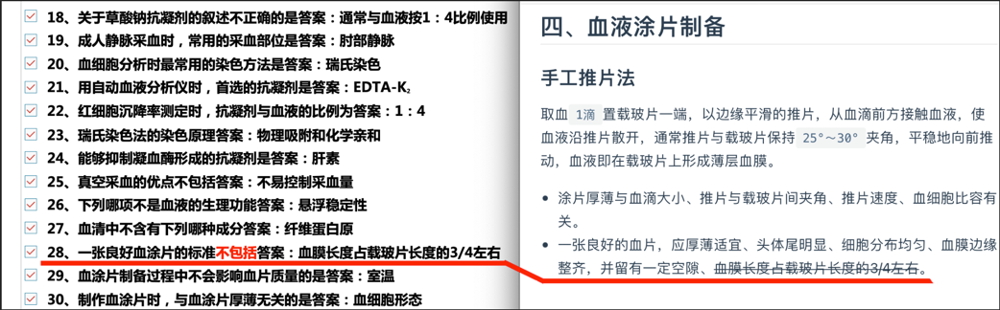
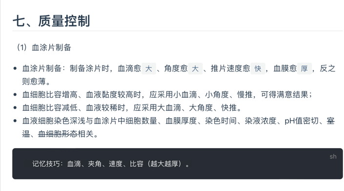
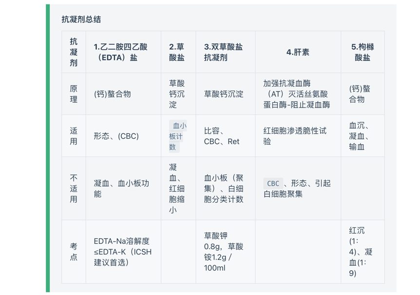

# 使用指南

## 简介

本站文档根据2022年检验技士考试指导教材 对照 2022年临床检验题库 重新编辑排版。

## 1.三类标记方式
提炼题库中的考点，通过`标记`、【新增】、~~干扰项~~，将题库考点标注到教材当中。

#### `标记一`
标记：对照2022年临床检验题库，将答案（考点）`标记`在文档里标记。



#### 【标记二】
【新增】：对照2022年临床检验题库，将教材没有的考点【新增】到文档中。

#### ~~标记三~~
~~干扰项~~：对照2022年临床检验题库，将题库里的~~干扰项~~标记到文档中。


## 2.三类知识总结

```
第一类：记忆技巧
```


::: tip 第二类：将知识点整理成表格，方便记忆
:::




::: warning 第三类：重点展示。
:::

