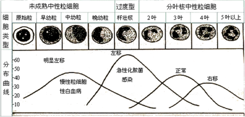
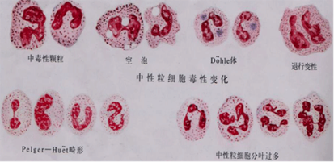
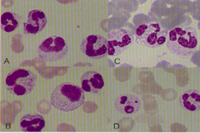
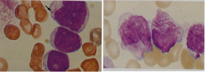
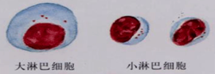
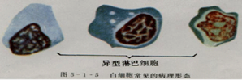
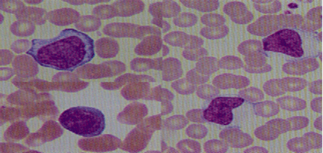
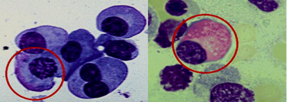
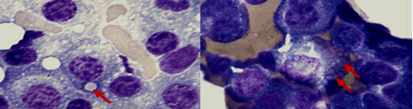

[[toc]]
---
sidebar: auto
---
# 白细胞检查

## 一、概要
### 粒细胞
- **要点1：** 
  * 粒细胞起源于造血干细胞，一个原粒细胞经过增殖发育，最终生成8～32个分叶核粒细胞。此过程在骨髓中约需10d，成熟粒细胞进入血液后仅存6～10h，然后逸出血管进入组织或体腔内。
  * 粒细胞在组织中可行使防御功能1～2d，衰老的粒细胞主要在单核-巨噬细胞系统破坏，其余从口腔、气管、消化道、泌尿生殖道排出。正常情况下，每小时进行更新的粒细胞约有10%。目前，根据粒细胞群发育阶段，人为地分为分裂池、成熟池、贮备池、循环池和边缘池等。
    * ①分裂池：包括`原粒`细胞、`早幼粒`细胞和`中幼粒`细胞，能合成DNA，具有分裂能力；
    * ②成熟池：包括`晚幼粒`细胞和`杆状核粒`细胞，失去分裂能力；
    * ③贮备池：包括`杆状核粒`细胞和`分叶核粒`细胞，成熟粒细胞贮存于骨髓，在贮备池中停留3～5d，数量为外周血的5～20倍，贮备池中细胞，在机体受到感染和其他应激反应时，可释放入循环血液。
    * ④循环池：进入外周血的成熟粒细胞有一半随血液而循环，`白细胞计数值`就是循环池的粒细胞数；
    * ⑤边缘池：进入外周血的另一半成熟粒细胞，黏附于微静脉血管壁，边缘池和循环池粒细胞`保持动态平衡`。中性粒细胞具有趋化、变形、黏附作用以及吞噬、杀菌等功能。
### 单核细胞
- **要点2：**
  * 骨髓多能造血干细胞分化为髓系干细胞和粒～单系祖细胞，而后发育为原单核细胞、幼单核细胞及单核细胞，释放至外周血中单核细胞（M），大部分黏附于血管壁，少数随血液循环，在血中停留3～6d后即进入组织或体腔内，转变为幼吞噬细胞，再成熟为吞噬细胞，寿命可达2～3个月。
  * 单核-巨噬细胞具有吞噬病原体功能（如病毒、原虫、真菌：结核杆菌等）、吞噬和清理功能（如组织碎片、衰老血细胞、抗原抗体复合物、凝血因子等）、吞噬抗原传递免疫信息功能，还参与杀菌、免疫和抗肿瘤作用。

### 淋巴细胞
- **要点3：**
  * 淋巴细胞起源于骨髓造血干细胞/祖细胞，是人体主要免疫活性细胞，约占白细胞总数的1/4。分为：在骨髓、脾、淋巴结、其他淋巴组织生发中心发育成熟的B淋巴细胞，占20%～30%，B淋巴细胞寿命较短，一般3～5d，经抗原激活后分化为浆细胞，产生特异性抗体，参与体液免疫。
  * 在胸腺、脾、淋巴结和其他淋巴组织，依赖胸腺素发育成熟者称为T淋巴细胞，占60%～70%，T淋巴细胞寿命较长，可达数月至数年，被抗原致敏后可产生多种免疫活性物质，参与细胞免疫。还有少数NK细胞（杀伤细胞）、N细胞（裸细胞）、D细胞（双标志细胞）。观察淋巴细胞数量变化，有助于了解机体免疫功能状态。

## 二、白细胞计数
### 方法学评价
- **要点4：** 
  * 1.显微镜计数法
  * 简便易行，但重复性和准确性较差。
  * 2.血液分析仪计数法
  * 计数细胞数量多，速度快，易于标准化，计数精确性较高，但需特殊仪器。某些人为因素（如抗凝不充分）、病理情况（如出现有核红细胞、巨大血小板、血小板凝集等）可干扰白细胞计数。使用前须按NCCLS规定方法对仪器进行校准，且须认真坚持日常质控工作。
### 质量控制
  - **要点5：** 
    * 1.经验控制
    * （1）与红细胞数比较：正常情况下，红细胞数/白细胞数约为（500～1000）：1。
    * （2）与血涂片白细胞分布密度一致性，如下表。
  如表：血涂片上WBC分布密度与WBC数量关系

    血涂片上WBC数/HP|	WBC（×109/L）	|血涂片上 WBC数/HP 	|WBC （×109/L）
    ----|----|----|-----
    2～4	             | （4～7）	|6～10	            |（10～12）
    4～6	              |（7～9）	|10～12	            |（13～18）

### 参考值
- **要点6：**
  * 成人：（4～10）×109/L。
  * 新生儿：（15～20）×109/L。
  * 6个月～2岁：（11～12）×109/L。
  * 儿童：（5～12）×109/L。

## 三、白细胞分类计数
### 方法学评价
- **要点7：**
  * 1.显微镜分类法
  * 能准确地根据细胞形态特征进行分类，并可发现细胞形态及染色有无异常，是白细胞分类计数参考方法，但耗时、精确性和重复性较差。
  * 2.血液分析仪分类法
  * 有三分群和五分类两法，速度快，准确性高，易于标准化，能提示异常结果，结果以数据、图形、文字等多种形式展示，是白细胞分类和筛检首选方法，但不能完全代替显微镜检查法对异常白细胞进行鉴别和分类。

### 质量控制
- **要点8：** 
  * 1.影响分类计数准确性因素
  * 包括涂片中细胞分布不均和细胞辨识能力差异。
  * （1）细胞分布不均：通常涂片尾部中性粒细胞较多，淋巴细胞较少，单核细胞沿涂片长轴均匀分布。幼稚细胞分布在涂片尾部和边缘，淋巴细胞、嗜碱性粒细胞分布在涂片头部和体部。采用“城垛”式移动进行涂片分类，有助于弥补涂片中细胞分布的差异。
  * （2）形态识别差异：主要因素是①杆状核和分叶核诊断标准差异；②单核细胞和大淋巴细胞鉴别能力差异；③染色较差的涂片，嗜碱性粒细胞和中性粒细胞难以区分。
  * 2.影响分类计数精确性因素
  * 精确度常用重复计数后计算的s或CV来表示。人工计数准确性虽高，但精确性差，与分类计数细胞数量较少有关。计数细胞量越大，误差越小。因此，临床上如需观察细胞数量变化作为诊治指标时，应提高细胞计数量，如下表。
  如表：白细胞总数与分类白细胞数的关系

  白细胞总数（×109/L）|	应分类白细胞数（个）|	白细胞总数（×109/L）|	应分类白细胞数（个）
  -----|------|------|-------
  ＜4	|50～100	|20～30	|300
  4～10	|100	|＞30	|400
  10～20	|200	| 	    | 
- **要点9：**
如表：成人白细胞分类参考范围
 
  分类    |百分率（%） |	绝对值（×109/L）
  -----|------|-------
  中性杆状核粒细胞	|1～5	|（0.04～0.5）
  中性分叶核粒细胞	|50～70	|（2～7）
  嗜酸性粒细胞	|0.5～5	|（0.02～0.5）
  嗜碱性粒细胞	|0～1	|（0～1）
  淋巴细胞	|20～40	|（0.8～4）
  单核细胞	|3～8	|（0.12～0.8）

如图：各种白细胞形态
- 

### 临床意义
- **要点10：**
  * 中性粒细胞
  * （1）生理性增多：正常中性分叶核粒细胞中，2叶核占10%～30%，3叶核占40%～50%，4叶核占10%～20%，5叶核＜5%。中性分叶核粒细胞＞70%，绝对值＞7×109/L称为增多。
  * 生理性中性粒细胞增多通常不伴有白细胞质量改变。
    * 通常原因为：
    * 1）年龄变化：新生儿白细胞较高`可达（15～30）×109/L`，3～4d后降至10×109/L，约保持3个月，逐渐减至成人水平。新生儿中性粒细胞占绝对优势（6～28）×109/L，1周内降至5×109/L，`第6～9d减至与淋巴细胞大致相等`，随后淋巴细胞逐渐增多，婴儿期以淋巴细胞数为主`（可达70%）`，2～3岁后，淋巴细胞逐渐减低，中性粒细胞逐渐增高，4～5岁两者基本相等，形成中性粒细胞和淋巴细胞2次交叉变化曲线，到青春期时与成人相同。
    * 2）日间变化：在安静、休息时白细胞数较低，在活动、进食后白细胞数较高。早晨较低、下午较高。一日内最高值和最低值可相差1倍。
    * 3）运动、疼痛、情绪变化：脑力和体力劳动、冷热水浴、日光或紫外线照射等使白细胞轻度增高。`严寒、暴热`使白细胞数高达15×109/L或更高。剧烈运动、剧痛、情绪激动使白细胞显著增高。
    * 4）妊娠与分娩：妊娠超过5个月白细胞可达15×109/L以上，妊娠最后1个月波动于（12～17）×109/L，分娩时白细胞可达34×109/L，分娩后2～5d内恢复正常。
    * 5）其他：吸烟者白细胞计数高于非吸烟者30%（包括中性粒细胞、淋巴细胞和单核细胞）。
  * （2）病理性增多
  * 1）反应性增多：是机体的应激反应，动员骨髓贮备池中的粒细胞释放或边缘池粒细胞进入血液循环，增多白细胞大多为分叶核粒细胞或杆状核粒细胞。见于`急性感染或炎症`、广泛组织损伤或坏死、急性溶血、急性失血、急性中毒、`恶性肿瘤`（如非造血系统恶性肿瘤）、其他原因（如类风湿关节炎、自身免疫性溶血性贫血、痛风、严重缺氧、应用皮质激素、肾上腺素、氯化锂等）。
  * 2）异常增生性增多：为造血干细胞克隆性疾病，造血组织中粒细胞大量增生。见于粒细胞白血病，如急性白血病以幼稚白血病细胞增多为主，慢性白血病以成熟白血病细胞增高为主，骨髓增殖性疾病如真性红细胞增多症、原发性血小板增多症、骨髓纤维化症。
如表：病情严重和恢复期的血象变化
病情严重	恢复期
白细胞数、中性粒细胞比值	急剧增加或异常下降	逐渐恢复正常
未成熟中性粒细胞	大量出现	逐渐减少或消失
嗜酸性粒细胞	消失	重新出现或暂时上升
淋巴细胞	减低（病毒感染时增加）	增加或恢复正常
单核细胞	减少，但某些疾病时增加（如结核）	逐渐增多或恢复正常
中性粒细胞毒性变化	出现或增多	减少或消失
  
#### 中性粒细胞减低
- **要点12：**
  * 当中性粒细胞绝对值低于1.5×109/L，称为粒细胞减低症，低于0.5×109/L时，称为粒细胞缺乏症。见于：
    * ①某些感染，如`伤寒、副伤寒`、流感等；
    * ②血液病，如典型的`再生障碍`性贫血、少数急性白血病；
    * ③慢性理化损伤，如`电离辐射`（X线等）、长期服用氯霉素后；
    * ④自身免疫性疾病，如系统性红斑狼疮`（SLE）`等；
    * ⑤脾功能亢进，如门脉性肝硬化、班替综合征等。

#### 中性粒细胞核象变化
- **要点13：**
  * 正常时，外周血中性粒细胞以3叶核居多，杆状核与分叶核比值为1：13，见下图。
  * 如图：中性粒细胞核象变化
  

  * 1）核左移：外周血中杆状核粒细胞增多或（和）出现晚幼粒、中幼粒、早幼粒等细胞时`（＞5%）`称为核左移。
  * 再生性左移是指核左移伴有白细胞总数增高者，表示机体反应性强、骨髓造血功能旺盛，见于感染（尤其急性化脓性感染）、急性中毒、急性溶血、急性失血等。
  * 轻度左移：白细胞总数及中性粒细胞百分数略增高，仅杆状核粒细胞增多`（＞5%）`，表示感染程度较轻，机体抵抗力较强。
  * 中度左移：白细胞总数及中性粒细胞百分数均增高，杆状核粒细胞`＞10%`并有少数晚幼粒细胞和中毒性改变，表示有严重感染。
  * 重度左移：白细胞总数及中性粒细胞百分数明显增高，杆状核粒细胞`＞25%`，并出现幼稚的粒细胞。退行性左移：指核左移而白细胞总数不增高甚至减低者，见于再生障碍性贫血、粒细胞减低症、严重感染（如伤寒、败血症等）。
  * 2）核右移：中性粒细胞核分叶`5叶以上者超过3%`则称为核右移，常伴白细胞总数减低，为造血物质缺乏、脱氧核糖核酸减低、骨髓造血功能减退所致。见于营养性巨幼细胞性贫血、恶性贫血、应用抗代谢药物（如阿糖胞苷、6-巯基嘌呤等）、炎症恢复期。
- **要点14：**
  * 淋巴细胞
  * （1）生理性增多：外周血淋巴细胞绝对值成人＞4×109/L、儿童＞7.2×109/L、4岁以下＞9×109/L。见于儿童期淋巴细胞生理性增多。
  * （2）病理性增多：见于急性传染病（如风疹、流行性腮腺炎、传染性淋巴细胞增多症、传染性单核细胞增多症、百日咳等）、某些慢性感染（如结核病等）、肾移植术后（如发生排异反应）、白血病（如淋巴细胞性白血病、白血性淋巴瘤）、再生障碍性贫血、粒细胞缺乏症。
  * （3）减低：见于接触放射线、应用肾上腺皮质激素、促肾上腺皮质激素、严重化脓性感染。
- **要点15：**
  * 单核细胞
  * （1）生理性增多：外周血单核细胞绝对值计数超过0.8×109/L。儿童外周血单核细胞较成人稍多，平均为9%，出生后2周婴儿可呈生理性单核细胞增多，可达15%或更多，妊娠时生理性增高与中性粒细胞变化相平行。
  * （2）病理性增多：见于某些感染（如亚急性感染性心内膜炎、疟疾、黑热病等）、急性感染恢复期、活动性肺结核（如严重的浸润性和粟粒性结核）、某些血液病（如粒细胞缺乏症恢复期、恶性组织细胞病、淋巴瘤、单核细胞白血病、骨髓增生异常综合征）。

## 四、嗜酸性粒细胞
### 参考值
- **要点16：**
  * （成人：（0.05～0.5）×109/L）
  * 1.生理变化
    * （1）年龄变化：5岁以下儿童嗜酸性粒细胞约为（0～0.8）×109/L，5～15岁约为（0～0.5）×109/L。
    * （2）日间变化：外周血嗜酸性粒细胞浓度在1d内有波动，白天低，夜间高，上午波动大，下午较恒定，与糖皮质激素脉冲式分泌有关。
    * （3）劳动、寒冷、饥饿、精神刺激等使嗜酸性粒细胞减低。
  * 2.增多
  * 成人外周血嗜酸性粒细胞＞0.5×109/L。
    * （1）寄生虫病：肠道外寄生虫，如血吸虫、华支睾吸虫、肺吸虫、丝虫、包虫等，以及肠道钩虫感染时，嗜酸性粒细胞显著增高。
    * （2）变态反应性疾病：如支气管哮喘、坏死性血管炎、药物过敏反应、荨麻疹、血管神经性水肿、血清病、异体蛋白过敏、枯草热等嗜酸性粒细胞呈轻度或中等度增高。
    * （3）皮肤病：如湿疹、剥脱性皮炎、天疱疮、银屑病等嗜酸性粒细胞呈轻度或中度增高。
    * （4）血液病：如慢性粒细胞白血病、真性红细胞增多症、多发性骨髓瘤、脾切除后、嗜酸性粒细胞白血病、霍奇金病等。
    * （5）某些恶性肿瘤：癌肿伴有嗜酸性粒细胞增高（如肺癌）。
    * （6）某些传染病：传染病感染期时，嗜酸性粒细胞常减低，在恢复期时，嗜酸性粒细胞暂时性增高。但猩红热急性期，嗜酸性粒细胞增高。
    * （7）其他：风湿性疾病、脑垂体前叶功能减低症、肾上腺皮质功能减低症、过敏性间质性肾炎等。
    * （8）高嗜酸性粒细胞综合征：包括伴有肺浸润的嗜酸性粒细胞增多症、过敏性肉芽肿、嗜酸性粒细胞心内膜炎等。
  * 3.嗜酸性粒细胞计数的其他应用
    * （1）观察急性传染病的预后：肾上腺皮质有促进机体抗感染的能力，当急性感染（如伤寒）时，肾上腺皮质激素分泌增高，嗜酸性粒细胞减低，疾病恢复期时嗜酸性粒细胞又增多。如临床症状严重，嗜酸性粒细胞不减低，说明肾上腺皮质功能衰竭，预后不良。如嗜酸性粒细胞持续减低，甚至完全消失，说明病情严重。
    * （2）观察手术和烧伤患者的预后：手术后4h嗜酸性粒细胞显著减低，甚至消失，24～48h后逐渐增多。大面积烧伤患者，数小时后嗜酸性粒细胞完全消失，且持续时间较长。
    * （3）测定肾上腺皮质功能：患者作嗜酸性粒细胞直接计数后，然后肌注或静脉滴注ACTH 25mg，直接刺激肾上腺皮质，或注射0.1%肾上腺素0.5ml，刺激垂体前叶分泌ACTH，间接刺激肾上腺皮质。肌注后4h或静脉滴注后8h，再作嗜酸性粒细胞直接计数。
    * （4）结果判断：①在正常情况下，注射ACTH或肾上腺素后，嗜酸性粒细胞比注射前应减低50%以上。②肾上腺皮质功能正常，而垂体前叶功能不良者，则直接刺激时减低50%以上，间接刺激时不减低或减低很少。③垂体功能亢进时，直接和间接刺激均可减低80%～100%。④垂体前叶功能正常，而肾上腺皮质功能不良者，直接和间接刺激减低均小于50%，如艾迪生（Addison）病。

## 五、白细胞形态检查
###  检测原理
- **要点17：**
  * 血涂片经染色后，在普通光学显微镜下作白细胞形态学观察和分析。
### 临床意义
  * 正常白细胞形态：瑞氏染色正常白细胞的细胞大小、核和质的特征，见下表。
  * 如表：外周血五种白细胞形态特征
  
    |细胞类型	    |大小（μm）     |外形             |核形  |染色质|着色 |颗粒|
    |---|--|--|--|--|--|---|
    |中性杆状核粒细胞	|10～15	     |圆形	         |弯曲呈腊肠样，两端钝圆	         |深紫红色粗糙           |淡橘红色	|量多，细小，均匀布满胞质，浅紫红色|
    |中性分叶核粒细胞	|同上	         |同上	         |分为2～5叶，以3叶为主	         |同上	                |同上	    |同上|
    |嗜酸性粒细胞	|11～16	     |圆形	         |分为2叶，呈眼镜样	             |深紫红色，粗糙	        |淡橘红色	|最多粗大、圆面均匀，充满胞质，鲜橘红色|
    |嗜碱性粒细胞	|10～12	     |圆形	         |核结构不清，分叶不明显	         |粗而不匀	            |淡橘红色	|最少，大小和分布不均，常覆盖核上，蓝黑色|
    |淋巴细胞	    |6～15	     |圆形或椭圆形	 |圆形或椭圆形，着边	             |深紫红色，粗块状	    |透明淡蓝色	|小淋巴细胞一般无颗粒，大淋巴细胞可见少量粗大不均匀，深紫红色颗粒|
    |单核细胞	    |10～20	     |圆形或不规则形	 |不规则形，肾形，马蹄形，或扭曲折叠	 |淡紫红色，细致疏松呈网状	|淡灰蓝色	|最多细小，灰尘样紫红色颗粒弥漫分布于胞质中|

### 异常中性粒细胞
- **要点18：**
    * 1）毒性变化：在严重传染病、化脓性感染、中毒、恶性肿瘤、大面积烧伤等情况下，中性粒细胞有下列形态改变：大小不均（中性粒细胞大小相差悬殊）、中毒颗粒（比正常中性颗粒粗大，大小不等，分布不均匀，染色较深，呈黑色或紫黑色）、空泡（单个或多个，大小不等）、 体（是中性粒细胞胞质因毒性变而保留的嗜碱性区域，呈圆形、梨形或云雾状，界限不清，染成灰蓝色，直径约1～2μm，亦可见于单核细胞）、退行性变（胞体肿大，结构模糊，边缘不清晰，核固缩，核肿胀，核溶解等）。上述变化反映细胞损伤的程度，可以单独出现，也可同时出现。见下图。
    * 2）巨多分叶核中性粒细胞：细胞体积较大，直径16～25μm，核分叶常在5叶以上，甚至在10叶以上，核染色质疏松。见于巨幼细胞贫血、抗代谢药物治疗后。
    * 3）棒状小体（Auer小体）：细胞质中出现呈紫红色细杆状物质，长约1～6μm，1条或数条，见于急性白血病，尤其是颗粒增多型早幼粒细胞白血病（M3型）可见数条至数十条成束的棒状小体，急性单核细胞白血病可见1条细长的棒状小体，而急性淋巴细胞白血病则不出现棒状小体。
    * 4）Pelger-Huet畸形：细胞核为杆状或分2叶，呈肾形或哑铃形，染色质聚集成块或条索网状。为常染色体显性遗传性异常，也可继发于某些严重感染、白血病、骨髓增生异常综合征、肿瘤转移、某些药物（如秋水仙胺、磺基二甲基异噁唑）治疗后。
    * 5）Chediak-Higashi畸形：细胞质内含有数个至数十个包涵体，直径约2～5μm，呈紫蓝、紫红色。见于Chediak-Higashi综合征，为常染色体隐性遗传。
    * 6）Alder-Reilly畸形：细胞质内含有巨大、深染的嗜天青颗粒，染深紫色。见于脂肪软骨营养不良、遗传性黏多糖代谢障碍。为常染色体隐性遗传。
    * 7）May-Hegglin畸形：细胞质内含有淡蓝色包涵体，见于严重感染。为常染色体显性遗传。
    * 如图：中性粒细胞中毒性改变和其他异常形态
  

    * 如图：中性粒细胞中毒性改变
  

    * 如图：Auer小体
  

### 异常淋巴细胞
- **要点19：**
  * 1）异型淋巴细胞：在传染性单核细胞增多症、病毒性肺炎、病毒性肝炎、流行性出血热等病毒性感染或过敏原刺激下，可使淋巴细胞增生，出现某些形态学变化，称为异型淋巴细胞。分为3型：
  * Ⅰ型`（空泡型，浆细胞型）`：胞体比正常淋巴细胞稍大，多为圆形、椭圆形、不规则形。核圆形、肾形、分叶状，常偏位。染色质粗糙，呈粗网状或小块状，排列不规则。胞质丰富，染深蓝色，含空泡或呈泡沫状。
  * Ⅱ型`（不规则型，单核细胞型）`：胞体较大，外形常不规则，可有多个伪足。核形状及结构与Ⅰ型相同或更不规则，染色质较粗糙致密。胞质丰富。染淡蓝或灰蓝色，有透明感，边缘处着色较深，一般无空泡，可有少数嗜天青颗粒。
  * Ⅲ型`（幼稚型）`：胞体较大，核圆形、卵圆形。染色质细致呈网状排列，可见1～2个核仁。胞质深蓝色，可有少数空泡。

  * 如图：正常淋巴细胞

  * 如图：异型淋巴细胞

  * 如图：异常淋巴细胞
  
- **要点20：**
  * 1）放射线损伤后淋巴细胞形态变化：淋巴细胞受电离辐射后出现形态学改变：核固缩，核破碎，双核，卫星核淋巴细胞（胞质中主核旁出现小核）。
  * 2）淋巴细胞性白血病时形态学变化：在急、慢性淋巴细胞白血病，出现各阶段原幼细胞，并有形态学变化。

### 异常浆细胞
- **要点21：**
  * 浆细胞：正常浆细胞直径8～9μm，胞核圆、偏位，染色质粗块状，呈车轮状或龟背状排列；胞质灰蓝色、紫绛色，有泡沫状空泡，无颗粒。如外周血出现浆细胞，见于传染性单核细胞增多症、流行性出血热、弓形体病、梅毒、结核病等。
  * 异常形态浆细胞有：
    * 1）Mott细胞：浆细胞内充满大小不等、直径2～3μm蓝紫色球体，呈桑椹样。见于反应性浆细胞增多症、疟疾、黑热病、多发性骨髓瘤。
    * 2）火焰状浆细胞：浆细胞体积大，胞质红染，边缘呈火焰状。见于IgA型骨髓瘤。
    * 3）Russell小体：浆细胞内有数目不等、大小不一、直径2～3μm红色小圆球。见于多发性骨髓瘤、伤寒、疟疾、黑热病等。
如图：火焰状细胞是指浆细胞内沉集了一些无定形沉淀物，并常染成红色，故名。现已知沉集物也是免疫球蛋白，且多见于IgA型多发性骨髓瘤。

如图：Russell小体是浆细胞浆内的一种数目不等，大小不一染成肉红色的球形小体，它是浆细胞中分泌免疫球蛋白的一种小体。如胞浆内充满此小体，核常被挤到一旁，称为葡萄细胞（grape cell）或称mott细胞 （桑椹状细胞）。Russell小体在染色中有时会溶解，以致染成淡黄色或形成空泡，成为泡沫样细胞，须与脂肪细胞区别。

	
	 

