[[toc]]

# 血液分析仪及其临床应用

**要点1：**
- `电阻抗法`血细胞计数原理`（库尔特原理）`是将等渗电解质溶液稀释的细胞悬液置入不导电的容器中，将小孔管（也称传感器）插进细胞悬液中。小孔管内充满电解质溶液，并有一个内电极，小孔管的外侧细胞悬液中有一个外电极。
- 如图：电阻抗原理示意图
  
- 当接通电源后，位于小孔管两侧的电极产生稳定电流，稀释细胞悬液从小孔管外侧通过小孔管壁上宝石小孔（直径＜100μm，厚度约75μm）向小孔管内部流动，使小孔感应区内电阻增高，引起瞬间电压变化形成脉冲信号，脉冲`振幅越高`，细胞`体积越大`，脉冲数量越多，细胞数量越多，由此得出血液中血细胞数量和体积值。
- 如图：血液分析仪计数原理示意图
  

## 白细胞分类计数原理
**要点2：**
- 根据电阻抗法原理，经溶血剂处理的、脱水的、不同体积的白细胞通过小孔时，脉冲大小不同。
    - 将体积为35～450fl白细胞，分为256个通道，其中，淋巴细胞为单个核细胞，颗粒少，细胞小。
    - 位于`35～90fl`的fl`小`细胞区，粒细胞（中性粒细胞）的核分多叶，颗粒多，胞体大。
    - 位于`160fl以上`的`大`细胞区，单核细胞、嗜酸性粒细胞、嗜碱性粒细胞、原始细胞、幼稚细胞等。
    - 位于`90～160fl`的单个核细胞区，又称为`中间型`细胞。
      如图：三分类血球分析仪工作原理示意图
      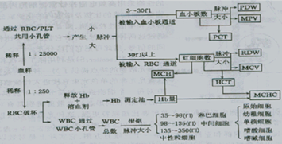

### 光散射法白细胞计数和分类计数原理
**要点3：**
容量、电导、光散射（VCS）法
- 1）利用电阻抗法原理测量细胞体积（V）。
- 2）利用电导（C）技术测量细胞内部结构：原理是利用高频电磁探针测量细胞内部结构，根据细胞核和细胞质比例、细胞内颗粒大小和密度来识别体积相同、但性质不同的两类细胞群体，如小淋巴细胞和嗜碱性粒细胞。
- 3）利用光散射（S）技术测量细胞形态和核结构：原理是利用激光照射进入计数区的每个细胞，根据散射光角度（10°～70°）的不同，提供每个细胞形态、核结构信息来鉴别中性粒细胞、嗜碱性粒细胞和嗜酸性粒细胞。
- 根据VCS原理，显示3种细胞散点图：DF1（体积和散射光）、DF2（体积和电导）、DF3（体积和电导，但只显示嗜碱性粒细胞群）。
- 如图：五分类血球分析仪原理示意图
  

**要点4：**
- 正常白细胞直方图，在35～450fl范围内将白细胞分为3群，左侧峰又高又陡为淋巴细胞峰，最右侧峰又低又宽为中性粒细胞峰，左右两峰间的谷区较平坦为单个核细胞峰。异常直方图意义见下表。
- 如表：白细胞直方图变化的部分原因

  |白细胞直方图变化	|主要原因
     |---|---
  |淋巴细胞峰左侧异常	|有核红细胞、血小板聚集、巨大血小板、未溶解红细胞、疟原虫、冷凝集蛋白、脂类颗粒、异形淋巴细胞
  |淋巴细胞峰右移，与单个核细胞峰左侧相连并抬高    	|急性淋巴细胞白血病、慢性淋巴细胞白血病、异形淋巴细胞
  |单个核细胞峰抬高增宽	|原始或幼稚细胞、浆细胞、嗜酸性粒细胞增多、嗜碱性粒细胞增多、单核细胞增多
  |单个核细胞峰与中性粒细胞峰之间异常	|未成熟的中性粒细胞、异常细胞亚群、嗜酸性粒细胞增多
  |中性粒细胞峰右移、抬高、增宽	|中性粒细胞绝对值增多
  |直方图多区出现异常	|以上多种原因引起

如图：急性淋巴细胞白血病时的白细胞直方图特点
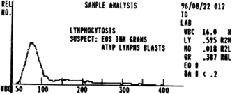

如图：急性淋巴细胞白血病时的白细胞直方图特点
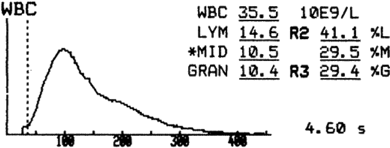

如图：急性非淋巴细胞白血病时的白细胞直方图特点
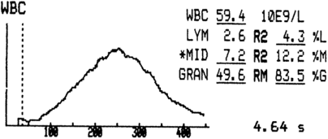

如图：慢性淋巴细胞白血病时的白细胞直方图特点
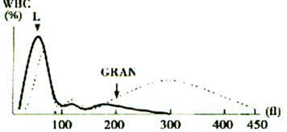
如图：单核细胞增多或嗜酸细胞增多症时的白细胞直方图特点
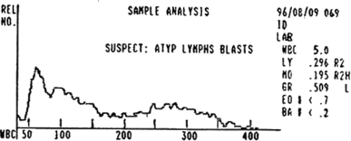
如图：异常淋巴细胞增多症时的白细胞直方图特点
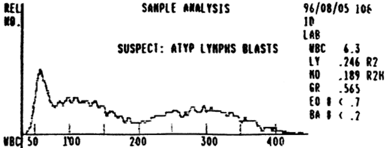
如图：慢性粒细胞白血病时的白细胞直方图特点
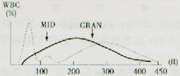
要点5：
- 红细胞直方图正常红细胞直方图，在36～360fl范围内分布两个细胞群体，从50～125fl区域有一个两侧对称、较狭窄的曲线，为正常大小的红细胞，从125～200fl区域有另一个低而宽的曲线，为大红细胞、网织红细胞。当红细胞体积大小发生变化时，峰可左移或右移，或出现双峰。
- 如图：缺铁性贫血红细胞直方图
  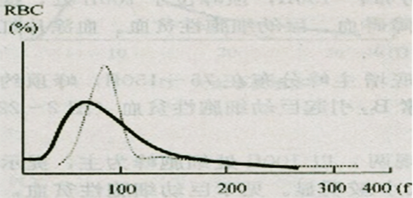
- 如图：轻型珠蛋白生成障碍性贫血红细胞直方图
  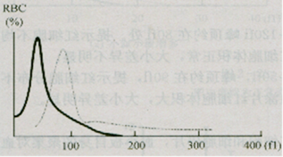
- 如图：铁幼粒细胞性贫血红细胞直方图
  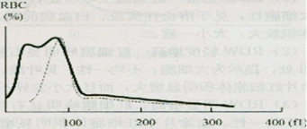
- 要点6：
- 血小板直方图正常血小板直方图，在2～30fl范围内分布，呈左偏态分布，集中分布于2～15fl内。当有大血小板或小红细胞、聚集血小板时，直方图显示异常。
  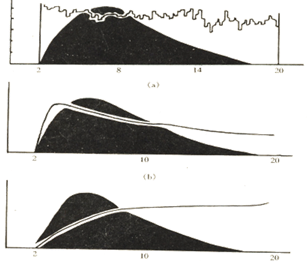
- 如图：受干扰的异常血小板直方图

- （a）大量红细胞碎片
- （b）多数血小板聚集
- （c）小红细胞增多
- 要点7：
## 方法学评价
仪器性能的评价新仪器安装、每次仪器维修后须对仪器性能进行测试、评价。ICSH公布的血液分析仪评价方案，包括下列内容：可比性、准确性、总重复性、精密度、线性范围、携带污染。
要点8：
干扰血液分析仪检测的因素
参数	|假性增高	|假性降低
---|---|---
WBC|溶血红细胞抵抗（尿毒症、胎儿和新生儿样本）、出现有核红细胞、冷球蛋白血症和冷纤维蛋白血症、血小板聚集、副蛋白血症、多量巨大血小板、异常血红蛋白（如AS、SS、AC、AE、AD、AO-Arab）、肝病、冷凝集素、骨髓异常增生综合征、巨幼细胞性贫血、脾切除后、纤维蛋白丝、高脂蛋白血症、脂肪污染样本、疟原虫、不稳定血红蛋白	|因抗体或细胞膜改变出现肿瘤细胞引起白细胞之间或白细胞和血小板聚集（如抗体介导中性粒细胞聚集，淋巴瘤细胞或肿瘤性浆细胞聚集）、血液放置时间超过3d引起白细胞溶解、室温贮存达24h、冷凝集素、微小凝块
RBC|冷球蛋白血症、冷纤维蛋白血症、多量大血小板、高白细胞、高脂血症	|冷凝集素、EDTA依赖性凝集、极小红细胞或碎片使红细胞落在阈值下限以外、因样本运输不当或异常红细胞的体外红细胞溶解、微小凝块
Hb|高脂血症、内源性或胃肠外营养、高白细胞、副蛋白或高丙球蛋白血症、冷球蛋白血症|
MCV|高渗状态、冷凝集素和EDTA依赖红细胞聚集、样本贮存在室温、高白细胞、EDTA过量|	低色素红细胞、低渗状态
Hct|MCV增高（除冷凝集素外）、RBC减低	|MCV减低、因极小细胞或体外溶血引起RBC增高、冷凝集素、微小凝块、高血糖
MCH|Hb增高、RBC减低、血管内溶血引起血浆游离血红蛋白增加|
MCH|	Hb增高、血管内溶血引起血浆游离血红蛋白增加、Hct或MCV和RBC减低、低渗状态	|MCV减低（除冷凝集素外）、因多量巨大血小板引起RBC增高、高渗状态
PLT|冷球蛋白、高甘油三酯血症或高脂血症、白细胞碎片、小红细胞或红细胞碎片、血红蛋白H病、微生物、经加热的血液样本	|部分凝集样本、采血时血小板活化、EDTA诱导血小板聚集、肝素诱导血小板聚集、血小板卫星、巨大血小板落在血小板阈值上限以外
Ret|红细胞包涵体、红细胞内寄生虫、白细胞碎片、血小板聚集、巨大血小板	|样本贮存室温

### 红细胞血红蛋白分布宽度（HDW）
- 要点9：
  反映红细胞内Hb含量异质性的参数，用单个红细胞Hb含量的标准差表示，正常参考范围为24～34g／L。遗传性球形红细胞增多症时RDW、HDW明显增高，为小细胞不均一性高色素性贫血。

### 血小板平均体积（MPV）
- 要点10：
    - （1）鉴别血小板减低的病因：MPV增高，见于外周血血小板破坏过多所致血小板减低。MPV减低，见于骨髓病变所致血小板减低。
    - （2）评估骨髓造血功能恢复情况：局部炎症时，骨髓造血未抑制，MPV正常。败血症时，骨髓造血受抑制，MPV减低。白血病缓解时，MPV增高。骨髓造血衰竭，MPV和血小板计数持续减低。骨髓功能恢复时，MPV先上升，血小板计数随后上升。
      要点11：
### 血小板分布宽度（PDW）
- 仪器测量一定数量血小板体积后，计算所得外周血血小板体积大小`异质性参数`。用血小板体积变异系数（CV）来表示。
    - PDW增大见于急性白血病化疗后、巨幼细胞性贫血、慢性粒细胞白血病、脾切除后、巨大血小板综合征、血栓性疾病、原发性血小板增多症、再生障碍性贫血；
    - PDW减低见于反应性血小板增多症。
- 要点12：
- 低荧光强度网织红细胞百分率（LFR）和高荧光强度网织红细胞百分率（HFR）
    - （1）骨髓移植：网织红细胞计数是监测骨髓造血恢复的重要参数，通常移植成功后网织红细胞比白细胞提前3～4d增高。HFR增高提示有较多未成熟细胞从骨髓进入外周血，故HFR变化比网织红细胞计数变化具有更重要意义。
    - （2）贫血：溶血性贫血时Ret、LFR、HFR明显增高；肾性贫血时HFR上升、LFR下降、Ret正常。
    - （3）放疗和化疗：长期化疗导致网织红细胞亚群发生变化，HFR、MFR减低早于LFR。骨髓恢复时，HFR、MFR又迅速上升。

### 网织红细胞成熟指数（RMI）
- 要点13：
- RMI＝（MFR＋HFR）／LFR×100。RMI增高，见于溶血性贫血、特发性血小板减少性紫癜（ITP）、慢性淋巴细胞白血病（CLL）、急性白血病、真性红细胞增多症、再生障碍性贫血、多发性骨髓瘤。
- RMI减低，提示骨髓衰竭和造血无效，见于巨幼细胞性贫血。
### 未成熟网织红细胞指数（IRF）
- 要点14：
- 指未成熟网织红细胞与总网织红细胞百分比。未成熟网织红细胞体积较大，含RNA的量多。
    - （1）监测骨髓移植后的情况：骨髓移植后，全血细胞计数、白细胞分类计数、网织红细胞计数是监测骨髓恢复造血的早期指标，其中，IRF是骨髓移植成功最早、最灵敏的指标。
    - （2）监测肾移植后的情况：IRF是肾移植成功较早、较灵敏的指标。

## 临床应用
### 红细胞直方图在贫血中的应用
- 要点15：
- 1.小细胞性贫血

  | RDW|特点
     |---|---
  | RDW`正常`|红细胞主峰左移，分布在55～100fl，波峰在75fl处，基底较窄，为小细胞低色素均一性图形，见于`轻型地中海贫血`。
  | RDW轻度增高|红细胞主峰左移，分布在55～100fl，波峰在65fl处，为小细胞低色素和细胞不均一性图形，见于`缺铁性贫血`。
  | RDW明显增高|红细胞显示`双峰`，小细胞峰明显左移，波峰在50fl处，大细胞峰顶在90fl处，基底较宽，为小细胞低色素不均一性图形，见于`铁粒幼细胞性贫血`、缺铁性贫血经治疗有效时。
- 2.大细胞性贫血
  | RDW|特点
  |---|---
  |RDW`正常`|红细胞主峰右移，分布在75～130fl，波峰在100fl处，为大细胞性图形，见于溶血性贫血、白血病前期、`再生障碍性贫血`、巨幼细胞性贫血。
  |RDW轻度增高|红细胞峰右移，基底增宽，分布在75～150fl，波峰在105fl处，为大细胞不均一性图形，见于`巨幼细胞性贫血`。
  |RDW明显增高|红细胞峰右移，出现`双峰`，以100fl处峰为主，为大细胞不均一性图形，见于`巨幼细胞性贫血治疗初期`。
- 3.正细胞性贫血
  | RDW|特点
  |---|---
  |RDW`正常`|红细胞分布在55～110fl，波峰在88f1处，为正常红细胞图形，见于慢性病贫血、急性失血、`骨髓纤维化`、骨髓发育不良。
  |RDW轻度增高|红细胞分布在44～120fl，波峰在80fl处，为红细胞不均一性图形，见于血红蛋白异常、骨髓纤维化。
  |RDW明显增高|红细胞分布在40～150fl，波峰在90fl处，为红细胞不均一性图形，见于早期或混合性营养不良。
