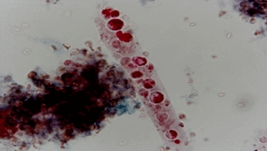
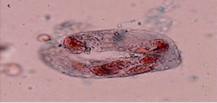

[[toc]]
---
sidebar: auto
---
# 尿有形成分检查

## 检查方法
尿沉渣是尿有形成分经离心沉淀、在显微镜下见到的尿有形成分。这些成分可来自肾脏或尿道脱落的细胞、形成的管型、结晶和感染的微生物、寄生虫等。

尿沉渣检查可以弥补尿理化检查不足造成的漏诊，对辅助泌尿系统疾病的定位诊断、鉴别诊断及预后判断等有重要意义。
目前，尿有形成分检查常用的方法有传统光学显微镜检查法和仪器检查法。

### 方法学评价
 

#### 1.显微镜检查
目前，尿沉渣检查虽可用尿沉渣分析仪进行定性或定量检查。
但迄今为止，仍无任何一种仪器可以完全代替显微镜检查，尿沉渣显微镜检查仍然是一种方法简便、价廉、结果最可靠的方法，尿沉渣显微镜检查是最重要参考方法。
##### （1）直接镜检法：
简便但`阳性率低，重复性差`，易漏诊。仅适用于急诊有明显混浊血尿、脓尿的检查。
##### （2）离心法：
敏感阳性率高，但操作较繁琐费时。国内外对临床尿沉渣检查方法，已制定了标准化操作程序。
##### （3）定量尿沉渣计数板法：
使尿沉渣检查更符合标准化的要求。
##### （4）染色法：
有助于识别细胞、`管型（明显提高检出率）`等。
- 1）Sternheirner-Malbin（SM）染色法：为常用的染色方法，能辨别管型，尤其是透明管型及各种形态的红细胞、上皮细胞，并能区别存活及死亡的中性粒细胞和检出闪光细胞。
- 2）巴氏染色法：观察有形成分的微细结构，对`泌尿道肿瘤细胞`和肾移植排异反应具有诊断意义。
- 3）其他特殊染色：
  - ①尿沉渣结合细胞化学染色、荧光抗体染色和酶免疫化学染色法：可清晰地辨别各种细胞、管型的形态结构。
  - ②细胞过氧化物酶染色：根据粒细胞含过氧化物酶的特点，可鉴别不典型的红细胞与白细胞，并可区别中性粒细胞管型及肾上皮细胞管型。
  - ③酸性磷酸酶染色：可区分透明管型与颗粒管型。
  - ④阿利新蓝、中性红等混合染色：可辨别白细胞种类和细胞存活情况；区分正常红细胞、小红细胞、影红细胞及上皮细胞、管型种类。

**尿酸碱度和渗透压对有机沉渣物影响**

   |有形成分|	红细胞	|白细胞	|管型
   |---|---|---|---
   |高渗尿	|皱缩，体积变小，星形或桑椹状	|体积缩小	|可存在较久
   |低渗尿	|膨胀，体积变大，不定形，无色	|膨胀，易破坏	|易崩裂
   |酸性尿	|可存在一定时间，体积缩小	|体积变小，能存在一定时间	|可存在较久
   |碱性尿	|溶解破裂，形成褐色颗粒	|膨胀，形成块状结构	|溶解，崩溃

**我国尿沉渣检查标准化要求**
 - （1）标准化操作：
   - 取尿`10ml`离心，采用水平式离心机，相对离心力（RCF）`400g`，离心`5min`。
   - 手持离心管45°～90°弃除上层尿，保留`0.2ml`尿沉渣，轻轻混匀后，取1滴置载玻片上，用18mm×18mm或22mm×22mm的盖玻片覆盖后（注意防止产生气泡）镜检。
   - 首先在低倍镜视野（10×10）下观察尿沉渣分布的情况，再转高倍镜视野（10×40）仔细观察细胞。
   - 检查细胞，应观察`10个高倍`视野；检查管型，应观察`20个低倍`视野，分别记录每个视野的细胞和管型数，计算平均值出报告；如数量过多可报告有形成分所占视野的面积情况，如1/3视野、1/2视野、满视野等。报告形式为：细胞XX/HPF；管型：XX/LPF。
 - （2）建议逐步实行尿沉渣定量板法报告方式（XX/μl）；还可采用尿沉渣分析工作站检查法，该法通过蠕动泵自动定量将尿沉渣吸入，并自动悬浮在流动池内，镜检后自动冲洗并定量报告，此两种方法均可实行标准化。

## 尿细胞检查

### 红细胞
 

#### （一）尿液红细胞形态
 

##### （1）正常红细胞：
尿中未经染色的红细胞形状为双凹圆盘状，浅黄色，直径大约8μm。
##### （2）异形红细胞：
尿异形红细胞常见的形态有：
1）大红细胞、小红细胞、棘形红细胞、环形红细胞、新月形红细胞、颗粒形红细胞、`边缘不规则【碱性尿液】`、皱缩红细胞`【似桑葚状】`（高渗尿中多见）、`影细胞（低渗尿中多见）`和红细胞碎片。

如图：不同形态的红细胞
 

 

根据尿中红细胞的形态可将血尿分为3种。
 - （1）`均一性`红细胞血尿（`非肾小球源性`血尿）：
   - 红细胞外形及大小多见正常，形态较一致。 整个尿标本中红细胞形态不超过2种。
 - （2）`非均一性`红细胞血尿（`肾小球源性`血尿）：
   - 红细胞大小不一，体积可相差3～4倍，尿中可见2种形态以上红细胞，如大红细胞、小红细胞、棘形红细胞等。

   - 关于区分肾性或非肾性红细胞血尿，仍无统一的标准。多数认为：肾性血尿，`异形红细胞≥80%`；
   - 非肾性血尿，异形红细胞≤50%，大部分红细胞为正常红细胞（或均一性红细胞）。
   
   - 近来，区分肾性和非肾性血尿的新方法有：
     - ①棘形红细胞百分率法：即红细胞具有1个或多个胞质突起的炸面圈样细胞≥5%为标准。
     - ②红细胞容积曲线法：
       - 肾性血尿，呈不对称曲线，尿红细胞平均容积（MCV）小于静脉血MCV；
       - 非肾源性血尿，红细胞容积曲线法呈对称曲线，尿红细胞的MCV大于静脉血红细胞的MCV。
     - ③流式细胞术：测定抗血红蛋白抗体或抗Tamm-Horsfall蛋白抗体染色的红细胞，以鉴别血尿来源。
 - （3）混合性血尿：指尿中含有均一性和非均一性两类红细胞。
:::tip
   为鉴别肾源性或非肾源性尿红细胞形态，最好采用相差显微镜
:::

#### （二）参考范围（见下表）。
尿沉渣主要成分参考值

 |方法	        |红细胞	|白细胞	|管型	|上皮细胞	|结晶
 |---|---|---|---|---|---
 |直接镜检法	|0～偶见/HP|	0～3/HP	|0～偶见/HP	|少见	|少见
 |离心镜检法	|0～3/HP	|0～5/HP	|0～偶见/HP	|少见	|少见
 |定量分析板法	|0～5/μl	|0～10/μl    |         |      |

#### （三）临床意义
 

##### （1）肾源性血尿
 - 见于急性或慢性肾小球肾炎、肾盂肾炎、红斑狼疮性肾炎、肾病综合征。
 - 肾源性血尿时，多伴尿蛋白增多明显，而红细胞增多不明显，还常伴有管型，如颗粒管型、红细胞管型、肾小管上皮细胞管型等。
##### （2）非肾源性血尿
 - 1）暂时性镜下血尿，如正常人，特别是青少年在剧烈运动、急行军、冷水浴、久站或重体力劳动后。女性患者，还应注意是否有月经血污染尿，应通过动态观察加以区别。
 - 2）泌尿系统自身疾病：如泌尿系统各部位的炎症、肿瘤、结核、结石、创伤、肾移植排异反应、先天性畸形等均可引起不同程度的血尿。
 - 3）其他：见于各种原因引起的出血性疾病，如特发性血小板减少性紫癜、血友病、再生障碍性贫血和白血病合并血小板减少、DIC、高血压、动脉硬化、高热；某些免疫性疾病如系统性红斑狼疮等；泌尿系统附近器官的疾病如前列腺炎、精囊炎、盆腔炎等。非肾性血尿的特点为尿红细胞增多，而蛋白不增多或增多不明显。

### 白细胞
 

#### （一）尿液白细胞形态
 

##### （1）完整的白细胞
新鲜尿中完整白细胞`【主要是中性粒细胞】`呈圆形，直径10～14μm，不染色时核较模糊，浆内颗粒清晰可见；
加入1%乙酸处理后，可清晰地看到细胞核；染色后粒细胞的胞核呈紫红色，细胞质中可见紫色颗粒；常分散存在。
在低渗尿及碱性尿中，胞体常胀大，直径可达18μm左右，约半数可在2h内溶解。
如图：白细胞
 

##### （2）闪光细胞
`急性肾盂肾炎`时，在低渗条件下，可见到中性粒细胞胞质内颗粒呈布朗分子运动，在高渗尿及酸性尿中，白细胞常萎缩，直径多为8～10μm。
如图：闪光细胞
 

##### （3）脓细胞
在炎症过程中破坏或死亡的中性粒细胞外形多变，不规则，结构模糊，浆内充满粗大颗粒，核不清楚，细胞常成团，边界不清，已为死亡细胞，称为脓细胞。
如图：成堆的脓细胞

尿中白细胞形态受下列因素影响：
- ①尿pH增高，白细胞容易破坏，pH8.4时，白细胞可于数分钟内破坏。
- ②尿稀释和尿渗透压减低，使尿中白细胞解体。
- ③尿标本置于温度高的环境或放置时间过长，白细胞破坏。

#### （二）临床意义
尿白细胞检查主要用于泌尿系统及邻近组织器官感染或炎症疾病诊断。
##### （1）肾盂肾炎
由细菌感染所致，尿细菌培养为阳性。有些肾盂肾炎首发症状为血尿，或镜下血尿；在急性期尿白细胞明显增多，还可见小圆上皮细胞、闪光细胞等；多数有白细胞管型。
##### （2）膀胱炎
尿白细胞增多常伴有脓尿，可见小圆上皮细胞、大圆上皮细胞、闪光细胞等，但无管型。急性期可有明显的肉眼脓尿。
用尿三杯试验可区分脓尿部位：如脓尿出现于第三杯，提示为膀胱颈炎、膀胱三角区炎症；如三杯均为脓尿（全程脓尿），提示病变位于膀胱颈以上的尿路，见于膀胱炎、输尿管炎、肾盂肾炎、肾脓肿、肾积脓等。
##### （3）女性阴道炎、宫颈炎和附件炎
尿白细胞增多，常伴大量鳞状上皮细胞。在血尿中，如红细胞与白细胞比例为500：1，应考虑出血，如比例为200：1，应考虑为炎症。
##### （4）肾移植后排异反应
尿中可出现大量淋巴细胞及单核细胞。
##### （5）其他
药物性急性间质性肾炎，尿单核细胞增多，而急性肾小管坏死时单核细胞减少或消失。嗜酸性粒细胞尿，见于某些急性间质性肾炎患者、药物所致变态反应等。

### 上皮细胞
尿上皮细胞来源：主要来自肾小管、肾盂、肾盏、输尿管、膀胱和尿道等。
#### （一）上皮细胞形态
 

##### （1）肾小管上皮细胞
来自`肾小管立方上皮`。肾小管上皮细胞形态不一，多为圆形或多边形，又称多边细胞，略大于中性粒细胞`（约为1.5倍）`；
胞核圆形，核膜厚，核突出易见；胞质中可有小空泡，分布不规则，有时见数量不等的含`铁血黄素颗粒`或脂肪小滴，此时又称`复粒细胞`。
肾小管上皮细胞的形态与移行上皮细胞底层的小圆上皮细胞相似，须注意鉴别。

如图：肾小管上皮细胞

##### （2）移行上皮细胞
由肾盂、输尿管、`膀胱`和尿道近膀胱段等处的移行上皮组织脱落而来。
 - 1）大圆上皮细胞：为表层移行上皮细胞，胞体较大，如果在器官充盈时脱落，则胞体较大，约为白细胞的4～5倍，多呈不规则圆形，核较小，常居中；如在器官收缩时脱落，则胞体较小，约为白细胞的2～3倍，形态较圆。
 - 2）尾形上皮细胞：多来自于`肾盂`，为中层移行上皮细胞，体积大小不一，常呈梨形、纺锤形或带尾形，核较大，呈圆形或椭圆形。
 - 3）小圆上皮细胞：为底层移行上皮细胞，形态较圆，较肾小管上皮细胞略大，但胞核较小。

如图：表层移行上皮细胞（大圆上皮细胞）
  

如图：中层移行上皮细胞（尾形上皮细胞）

如图：深层移行上皮细胞（小圆上皮细胞）

##### （3）鳞状上皮细胞
形体扁平而薄，又称复层扁平上皮细胞，来自于输尿管下部、膀胱、`尿道`和阴道的表层。
胞体为尿上皮细胞中的`最大`，形状不规则，多边多角，边缘常卷褶；
胞核很小，呈圆形或卵圆形，有时可有两个以上小核，全角化者核更小或无核，为上皮细胞中胞核最小者；胞质丰富。
如图：鳞状上皮细胞

#### （二）临床意义
 

##### （1）肾小管上皮细胞
 - 尿中一旦增多，即提示肾小管病变。见于：急性肾小管肾炎、肾病综合征、肾小管间质性炎症，如肾小管上皮细胞成堆出现提示肾小管有坏死性病变；
 - 慢性肾小球肾炎（可见复粒细胞）；
 - 肾移植术后1周，尿内可出现较多的肾小管上皮细胞，随后逐渐减少至恢复正常，但如发生排斥反应，则尿中可再度大量出现肾小管上皮细胞及管型；
 - 如肾小管上皮细胞中见含铁血黄素，则提示有慢性心力衰竭、肾梗死、血管内溶血等。
##### （2）移行上皮细胞增多
尿中出现大量移行上皮细胞时，提示有相应部位的炎症或坏死性病变。膀胱炎时，可见大量大圆上皮细胞成片脱落；肾盂肾炎时，常见尾形上皮细胞增多。
##### （3）鳞状上皮细胞增多
尿中大量出现或片状脱落，或伴白细胞、脓细胞，多见于`尿道炎`；女性患者，应排除阴道分泌物的污染。

### 其他细胞
病毒感染细胞及其包涵体
细胞内包涵体可作为病毒感染的诊断依据。通常用瑞-吉染色显微镜检查，可获得一定的阳性率。

常见细胞病毒包涵体有：人巨细胞病毒（CMV）包涵体、人乳头瘤病毒（HPV）包涵体、人多瘤病毒包涵体、单纯性疱疹病毒（HSP）包涵体等。

## 尿管型检查
### 一、尿管型形成机制和条件
 

#### （1）尿蛋白质和T-H蛋白浓度增高
尿蛋白质和`T-H蛋白`，是形成管型的基础物质。
病理情况下，由于肾小球基底膜的通透性增高，大量蛋白质由肾小球进入肾小管，肾小管的重吸收功能减低，过多的蛋白质在肾远曲小管和集合管内积聚。
#### （2）尿浓缩和肾小管内环境酸化
尿浓缩【~~有足够的尿量~~】可提高尿蛋白的含量，盐类增多，而尿酸化后又促进蛋白凝固、沉淀，由溶胶变为凝胶并进一步固化，致使尿流速减慢，促使肾小管远端形成管型。
#### （3）有可供交替使用的肾单位
病理情况下，也需要有交替使用的肾单位，使尿在肾单位的下部有足够停留时间，蛋白等物质才能浓缩、沉淀形成管型。

### 二、管型种类
 

#### 1.透明管型
（1）形态：透明管型一般呈规则圆柱体状，但大小、长短很不一致；通常两边平行，两端钝圆（但有时一端可稍尖细），平直或略弯曲，甚至扭曲，质地菲薄，但也有少许颗粒或少量细胞黏附在管型外或包含于其中；
通常较窄而短，也有形态较大者；折光性较差，镜下观察时应将显微镜视野调暗，否则易漏检。
如图：透明管型

（2）临床意义：透明管型参考值为`0～1/LPF`。
 - 透明管型偶尔可见于成人浓缩尿、激烈运动后等。
 - 病理情况：透明管型可见于发热、麻醉、心力衰竭、肾受刺激后；如大量持续出现透明管型，同时可见异常粗大的透明管型和红细胞，表示肾小管上皮细胞有剥落现象，肾脏病变严重；可见于急、慢性肾小球肾炎、慢性进行性肾功能衰竭、急性肾盂肾炎、肾淤血、恶性高血压、肾动脉硬化、肾病综合征等。
#### 2.细胞管型
细胞管型指管型内含有的细胞超过管型`体积1/3`。
  
 
##### （1）红细胞管型

1）形态：管型中的红细胞常互相粘连而无明显的细胞界线，有的甚至残缺不全。 有时红细胞形态完整、清晰，接近正常，易于识别，有时因溶血仅见红细胞残影。
如图：红细胞管型

2）临床意义：正常尿中无红细胞管型。
病理情况：见到红细胞管型，提示肾小球疾病和肾单位内有出血；
可见于急性肾小球肾炎、慢性肾炎急性发作、肾出血、肾充血、急性肾小管坏死、肾移植排斥反应、肾梗死、肾静脉血栓形成、恶性高血压等，亦可见于狼疮性肾炎、亚急性心内膜炎、IgA肾病、~~输尿管结石~~等。
##### （2）白细胞管型
1）形态：管型中含有退化变性坏死的白细胞（或脓细胞），一般为中性粒细胞，细胞呈球形，有时呈团性重合，因白细胞黏附性强，常可呈块状，也可单独存在，或与上皮细胞管型、红细胞管型并存。
如图：白细胞管型

2）临床意义：正常尿中无白细胞管型。出现白细胞管型，提示肾实质有`细菌感染`性病变，见于急性肾盂肾炎、肾脓肿、间质性肾炎、急性肾小球肾炎；非感染性炎症的肾病综合征、红斑狼疮肾炎；肾移植排斥反应（可见淋巴细胞管型）。
##### （3）肾上皮细胞管型
1）形态：管型内含肾小管上皮细胞。
可分为两大类：
 - 一类管型是由脱落肾小管上皮细胞与T-H糖蛋白组成，成片上皮细胞与基底膜分离，脱落细胞粘在一起；
 - 另一类管型为急性肾小管坏死时，胞体较大，形态多变，典型的上皮细胞呈瓦片状排列，可充满管型，细胞大小不等，核形模糊，有时有浅黄色，此管型依其核形常难与白细胞管型区别，但管型内细胞比白细胞大，其大小和形态变化比白细胞复杂，可用加酸法呈现细胞核；酯酶染色呈阳性，过氧化物酶染色呈阴性，借此可与白细胞管型鉴别。
如图：上皮细胞管型

2）临床意义：正常尿中无肾上皮细胞管型。肾上皮细胞管型增多，常见于`肾小管病变`，如急性肾小管坏死、急性肾小球肾炎、间质性肾炎、肾病综合征、子痫、肾淀粉样变性、慢性肾炎晚期、重金属（如镉、汞、铋等）及其他化学物质、药物中毒。肾移植患者，在移植术3d内，尿出现肾小管上皮细胞管型为排异反应的可靠指标之一。
#### 3.颗粒管型
（1）形态：颗粒管型内含大小不等的颗粒物，含量超过`1/3管型`面积以上时，称为颗粒管型。

颗粒来自崩解变性的细胞残渣、血浆蛋白及其他物质，这些物质直接聚集于T-H糖蛋白基质。
颗粒管型常较透明管型短而宽大，呈淡黄褐色或棕黑色。
按颗粒的粗细又分为粗颗粒管型和细颗粒管型两种，
前者充满粗大颗粒，常呈暗褐色；
后者含许多微细颗粒，不透明，呈灰色或微黄色。
如图：颗粒管型

如图：粗颗粒管型 细颗粒管型

（2）临床意义：
正常人尿中`无`粗颗粒管型。颗粒管型的出现和增多`（如(0～3)/LPF）`，提示肾脏有`实质性病变`。
可见于脱水、发热，尤其多见于`急性或慢性肾小球肾炎`、肾病、肾小管硬化症、肾盂肾炎、病毒性疾病、慢性铅中毒、肾移植急性排斥反应、药物中毒等。
在急性肾功能衰竭多尿早期，可大量出现宽幅的颗粒管型；如出现于慢性肾炎晚期，提示预后不良。

#### 4.蜡样管型
（1）形态：蜡样管型由细颗粒管型或细胞管型进一步衍化而来，也有认为来自淀粉样变性的上皮细胞溶解后逐渐形成的管型，或者是透明管型在肾小管内停留时间较长演变而成。其外形似透明管型，为蜡烛样浅灰色或淡黄色，折光性强，质地厚，易折断，有切迹或泡沫状，较短而粗，一般略有弯曲，两端常不整齐。
如图：蜡样管型

（2）临床意义：正常尿中无蜡样管型。出现蜡样管型提示肾小管有严重病变，预后差。可见于慢性肾小球肾炎晚期、长期无尿和少尿、尿毒症、肾病综合征、肾功能不全、肾淀粉样变性；亦可见于肾小管炎症和变性、肾移植慢性排异反应、重症肝病等。

#### 5.脂肪管型

（1）形态：脂肪管型由肾小管上皮细胞脂肪变性、崩解，大量的脂肪滴进入管型内而形成。
管型内可见大小不等的折光很强的脂肪滴，当脂肪滴较大时，用偏振荧光显微镜检查，可见`“马耳他人‘十’字”`，脂肪滴较小时则互相重叠，用苏丹Ⅲ染色染成橙红色或红色。
如图：脂肪管型

（2）临床意义：正常尿中无脂肪管型。出现脂肪管型提示肾小管损伤、肾小管上皮细胞脂肪变性。可见于亚急性肾小球肾炎、慢性肾小球肾炎、中毒性肾病等，尤多见于`肾病综合征`。

#### 6.宽大管型
（1）形态：宽大管型是来自于破损扩张的肾小管、集合管或乳头管，多数宽大管型由颗粒管型和蜡样管型演变而来，但也可由其他管型演变而成。其宽可达50μm以上，是一般管型的2～6倍，既宽又长，可横跨整个视野，不规则，易折断，有时呈扭曲形。
（2）临床意义：正常尿无宽大管型。出现宽大管型，见于重症肾病、急性肾功能衰竭患者多尿早期、慢性肾炎晚期尿毒症（表示`预后不良`，故又称肾衰管型）。

#### 7.细菌管型和真菌管型
正常尿无细菌或真菌管型。出现细菌管型表明肾脏有病原体感染，常见于肾脓毒性疾病；出现真菌管型提示真菌感染。
如图：尿液中菌丝与胞子

#### 8.结晶管型
正常尿无结晶管型。出现结晶管型的临床意义类似相应的结晶尿，多见于代谢性疾病、中毒或药物所致的肾小管内结晶沉积伴急性肾衰、隐匿性肾小球肾炎、肾病综合征。
#### 9.混合管型
混合管型指管型内同时含有不同细胞及其他有形成分。正常尿中无混合管型。混合管型见于肾小球肾炎反复发作、出血和血管坏死、肾梗死、肾移植后急性排异反应等。

#### 11.其他管型
 

##### 1）血液管型
指血液进入肾小管后，红细胞崩解破坏，其各种成分所形成的管型称血液管型。其临床意义同红细胞管型。
##### 2）血红蛋白管型
管型内充满血红蛋白。可见于：急性肾小球肾炎、慢性肾炎急性发作、肾出血、肾充血、急性肾小管坏死、肾移植排斥反应、肾梗死、肾静脉血栓形成、血管内溶血、恶性高血压、狼疮性肾炎、亚急性心内膜炎、IgA肾病、肾单位发生梗死等。
##### 3）血小板管型
主要见于`弥漫性血管内凝血（DIC）`。
如图：血红蛋白管型

##### 4）肌红蛋白管型
见于急性`肌肉损伤`引起的肌红蛋白尿症和急性肾功能衰竭等。
##### 5）胆红素管型
见于严重阻塞性黄疸患者，尿胆红素试验常强阳性，可伴亮氨酸和酪氨酸结晶。
##### 6）圆柱体
形态与透明管型相似，但一端尖细，有时有扭曲或弯曲，如螺旋状，常伴透明管型同时出现。见于急性肾炎、肾血循环障碍或肾受刺激的患者。
 

#### 12.类管型相似物
 

##### 1）黏液丝
为长线条形，边缘不清，末端尖细卷曲，大小不等，常见暗淡纹。可见于正常尿中，尤其妇女尿中较多；如大量存在常表示`尿道受刺激`或有炎症反应。
##### 2）假管型
为`非晶形尿酸盐、磷酸盐`等形成的圆柱体，其外形与管型相似，但无管型的基质，边缘不整齐，两端破碎，其颗粒粗细不均，色泽发暗，加温或加酸后即消失，而真管型不变。

## 尿结晶检查
### （一）尿结晶形成
结晶食物产生各种酸性产物，与钙、镁、铵等离子结合生成各种无机盐及有机盐，再通过肾小球滤过、肾小管重吸收及分泌，排入尿中可形成结晶。
结晶的形成与尿的pH、温度、结晶物质及其胶体物质浓度和溶解度有关。
常见生理性和病理性结晶种类

  生理性	        |病理性	    |生理性	    |病理性
  ---|---|---|---
  草酸钙结晶	    |胱氨酸结晶	|磷酸盐类结晶	|胆固醇结晶
  尿酸结晶	        |胆红素结晶	|碳酸钙结晶	|磺胺类结晶
  非晶形尿酸结晶	|酪氨酸结晶	|碳酸铵结晶	|含铁血黄素
  马尿酸结晶体	    |亮氨酸      |   |

:::tip 
尿路结石多产草酸钙结晶
:::

### （二）生理性结晶
 

#### 1.尿酸结晶
尿酸是核蛋白中`嘌呤`代谢的产物，以尿酸或尿酸盐的形式经尿排出体外。
尿酸结晶在尿中呈黄色、暗棕色；形状有三棱形、哑铃形、蝴蝶形及不规则形。
 
正常情况下，如多食含高嘌呤的动物内脏可使尿中尿酸增高，一般无临床意义。
尿中尿酸浓度增高，可引起尿酸结晶增多（高尿酸结晶）。
大量尿酸沉淀于肾小管及间质中，可产生高尿酸肾病及尿酸结石，高尿酸亦可见于急性痛风症、儿童急性发热、慢性间质性肾炎等。

#### 2.磷酸盐类结晶
磷酸钙结晶
常见于弱碱性尿、中性尿有非结晶形、粒状形、三棱形，排列成星状或束状、`【“屋顶形”结晶】`。
如长期在尿中见到大量磷酸钙结晶，应考虑到甲状旁腺功能亢进、`肾小管性酸中毒`、长期卧床骨质脱钙等。

#### 3.尿酸铵结晶
此结晶呈黄色，不透明，有球状、哑铃形、树根状等形态，`【酸性、碱性尿液中均可出现】`，常见于陈旧尿中，一般无临床意义。如在新鲜尿中见到大量出现，提示膀胱有细菌感染。
### （三）病理性结晶
 

#### 1.胆红素结晶
此结晶外形为成束的针状或小块状，黄红色，由于氧化，有时可呈非结晶体色素颗粒。见于各种黄疸患者、肝癌、肝硬化和有机磷中毒等。
#### 2.胱氨酸结晶
为无色、`六边形`，边缘清晰、折光性强的薄片状结晶，由蛋白分解而来。正常尿中少见，大量出现多为`肾或膀胱结石`的征兆。
如图：胱氨酸结晶

#### 3.亮氨酸与酪氨酸结晶
亮氨酸与酪氨酸结晶为蛋白分解产物。
亮氨酸结晶呈淡黄色或褐色小球形或油滴状，并有密集辐射状条纹，折光性强。
酪氨酸结晶为`略带黑色的细针状结晶，成束、成团或羽毛状`。

可见于组织大量坏死的疾病，如`急性肝坏死`、`急性磷中毒`、糖尿病性昏迷、`白血病`或伤寒等。
如图：亮氨酸结晶 和 酪氨酸结晶

#### 4.胆固醇结晶
其外形为缺角的长方形或方形，无色透明，常浮于尿的表面，成薄片状，可见于膀胱炎、肾盂肾炎或有乳糜尿的患者；偶见于脓尿患者。
如图：胆固醇结晶

#### 5.含铁血黄素
为黄色小颗粒状，存在细胞内，可用亚铁氰化钾染色进行鉴别。当体内红细胞大量破坏时，各组织中均可有含铁血黄素沉积，如沉积于肾脏时，即可在尿中见到。

#### 6.磺胺类药物结晶：
 - ①乙酰基磺胺嘧啶（SD）：易在酸性尿中形成结晶。磺胺嘧啶结晶为棕黄色、不对称的麦秆束状、球状，但其束偏在一侧，两端不对称，有时呈贝壳状。
 - ②磺胺甲基异噁唑结晶：为无色透明、长方形、正方形的六面体结晶，似厚玻璃块，厚度大，边缘有折光阴影，散在或集束成“＋”、“×”形等排列。
如图；磺胺类药物结晶

	 

